## Reproducibility {auto-animate=true}

:::: {.columns}

::: {.column width=65%}

Reproducibility is the ability to regenerate results (e.g. tables, figures) using the provided code and data.

:::

::::

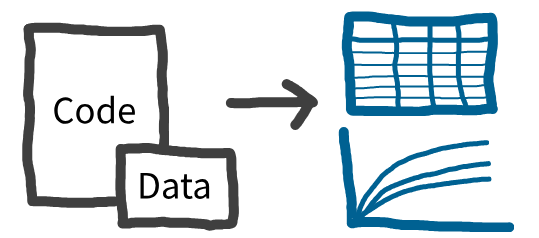

<!----------------------------------------------------------------------------
------------------------------- Next slide -----------------------------------
----------------------------------------------------------------------------->

## Reproducibility {auto-animate=true}

:::: {.columns}

::: {.column width=65%}

Reproducibility is the ability to regenerate results (e.g. tables, figures) using the provided code and data.

:::

::: {.column width=35%}


:::

::::

:::: {.columns}

::: {.column width=20%}

Why?

:::

::: {.column width=80%}

::: {.incremental .show-first}
* Reuse your own work more easily.
* Improve code clarity and quality
* Save time when revisiting analyses.
* Build trust.
* Help others verify and reuse your work.
:::

:::

::::

<!----------------------------------------------------------------------------
------------------------------- Next slide -----------------------------------
----------------------------------------------------------------------------->

## Reproducible Analytical Pipelines

**RAP**: Systematic approach. Every step (end-to-end) is transparent, automated and repeatable.

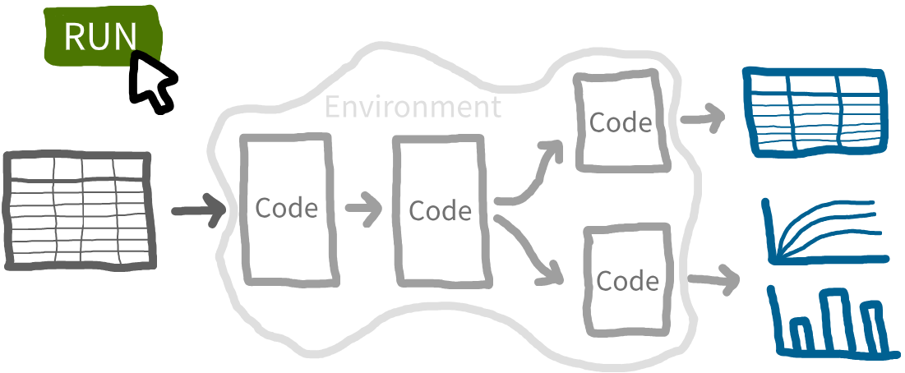

<!----------------------------------------------------------------------------
------------------------------- Next slide -----------------------------------
----------------------------------------------------------------------------->

## Discrete-event simulation (DES)

DES model a system as a sequence of events. For example, patients arriving, waiting, receiving treatment, and leaving.


<!----------------------------------------------------------------------------
------------------------------- Next slide -----------------------------------
----------------------------------------------------------------------------->

## Discrete-event simulation (DES) {auto-animate=true}

DES incorporate uncertainty - instead of e.g., fixed frequency of arrivals, sample from statistical distribution.

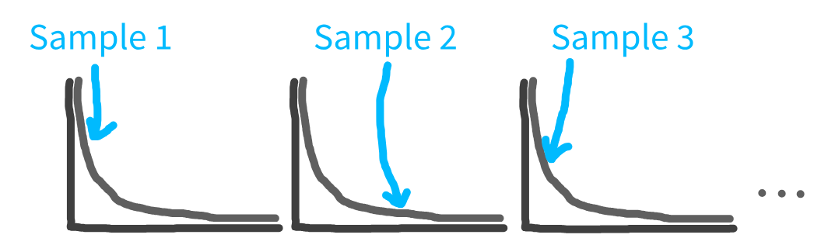

<!----------------------------------------------------------------------------
------------------------------- Next slide -----------------------------------
----------------------------------------------------------------------------->

## Discrete-event simulation (DES) {auto-animate=true}

DES incorporate uncertainty - instead of e.g., fixed frequency of arrivals, sample from statistical distribution.

:::: {.columns}

::: {.column}


::: {style="text-align: right;"}

<br>

This means each run <br>
produces different results.

:::

:::

::: {.column}

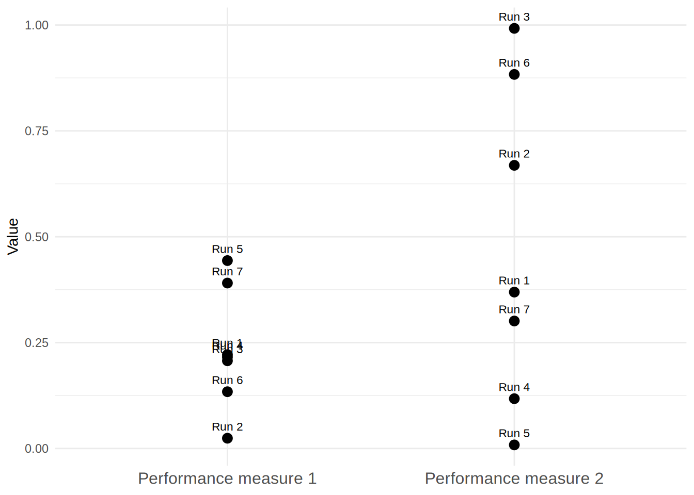

:::

::::

<!----------------------------------------------------------------------------
------------------------------- Next slide -----------------------------------
----------------------------------------------------------------------------->

## How to construct DES as RAP?

**Resource 1: NHS Levels of RAP**

[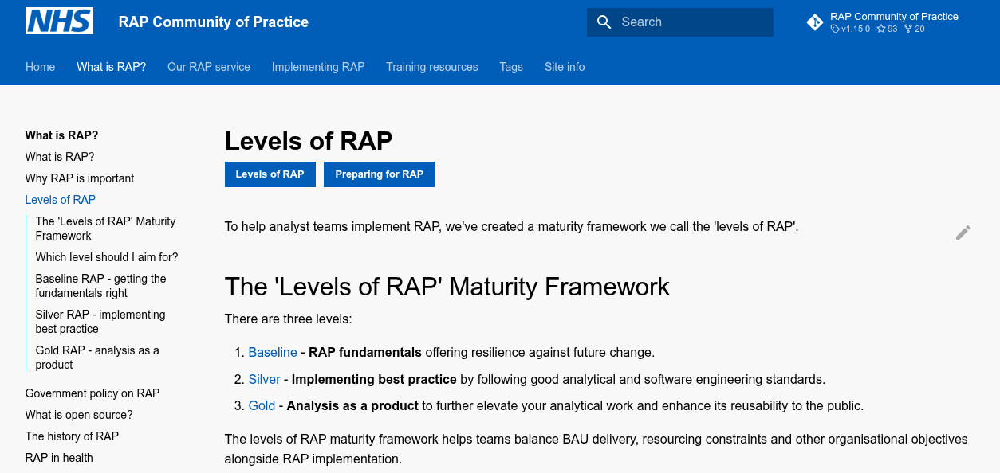](https://nhsdigital.github.io/rap-community-of-practice/introduction_to_RAP/levels_of_RAP/)

<!----------------------------------------------------------------------------
------------------------------- Next slide -----------------------------------
----------------------------------------------------------------------------->

## How to construct DES as RAP?

**Resource 1: NHS Levels of RAP**

::: {style="font-size: 60%"}

**🥉 Baseline** - RAP fundamentals offering resilience against future change.

* Data produced by code in an open-source language (e.g., Python, R).	
* Code is version controlled (see Git basics and using Git collaboratively guides).	
* Repository includes a README.md file (or equivalent) that clearly details steps a user must follow to reproduce the code (use NHS Open Source Policy section on Readmes as a guide).	
* Code has been peer reviewed.	
* Code is published in the open and linked to & from accompanying publication (if relevant).

:::

<!----------------------------------------------------------------------------
------------------------------- Next slide -----------------------------------
----------------------------------------------------------------------------->

## How to construct DES as RAP?

**Resource 1: NHS Levels of RAP**

::: {style="font-size: 60%"}

**🥈 Silver** - Implementing best practice by following good analytical and software engineering standards. Meeting all of the 🥉 baseline requirements, plus:

* Outputs are produced by code with minimal manual intervention.	
* Code is well-documented including user guidance, explanation of code structure  methodology and docstrings for functions.	
* Code is well-organised following standard directory format.	
* Reusable functions and/or classes are used where appropriate.	
* Code adheres to agreed coding standards (e.g PEP8, style guide for Pyspark).	
* Pipeline includes a testing framework (unit tests, back tests).	
* Repository includes dependency information (e.g. requirements.txt, PipFile, environment.yml).	
* Logs are automatically recorded by the pipeline to ensure outputs are as expected.	
* Data is handled and output in a Tidy data format.

:::

<!----------------------------------------------------------------------------
------------------------------- Next slide -----------------------------------
----------------------------------------------------------------------------->

## How to construct DES as RAP?

**Resource 1: NHS Levels of RAP**

::: {style="font-size: 60%"}

**🥇 Gold** - Analysis as a product to further elevate your analytical work and enhance its reusability to the public. Meeting all of the 🥉 baseline and 🥈 silver requirements, plus:

* Code is fully packaged.	
* Repository automatically runs tests etc. via CI/CD or a different integration/deployment tool e.g. GitHub Actions.	
* Process runs based on event-based triggers (e.g., new data in database) or on a schedule.
* Changes to the RAP are clearly signposted. E.g. a changelog in the package, releases etc. (See gov.uk info on Semantic Versioning).

:::

<!----------------------------------------------------------------------------
------------------------------- Next slide -----------------------------------
----------------------------------------------------------------------------->

## How to construct DES as RAP?

**Resource 2: STARS DES reproducibility recommendations**

[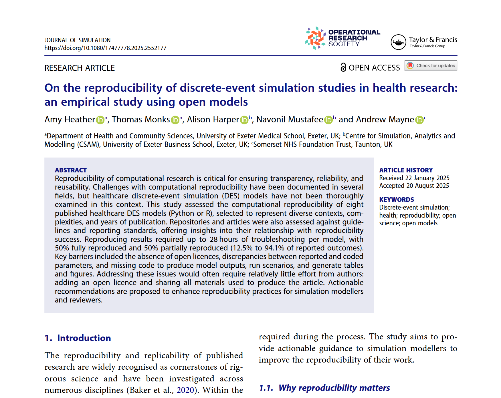](https://doi.org/10.1080/17477778.2025.2552177)

<!----------------------------------------------------------------------------
------------------------------- Next slide -----------------------------------
----------------------------------------------------------------------------->

## How to construct DES as RAP?

**Resource 2: DES reproducibility recommendations**

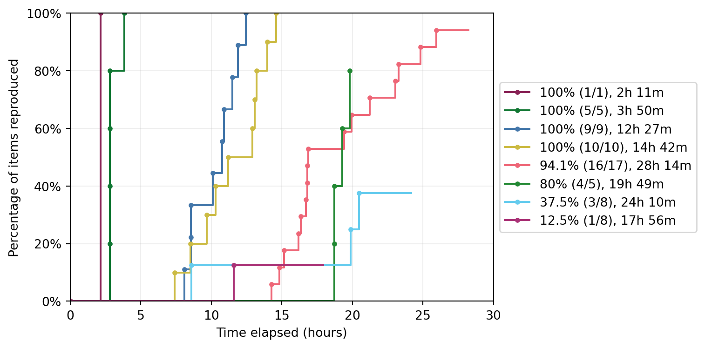

<!----------------------------------------------------------------------------
------------------------------- Next slide -----------------------------------
----------------------------------------------------------------------------->

---

:::: {.columns}

::: {.column width="35%"}

<h2 style="display: inline" data-id="my-heading">How to construct DES as RAP?</h2>

**Resource 2: STARS DES reproducibility recommendations**

:::

::: {.column width="65%"}

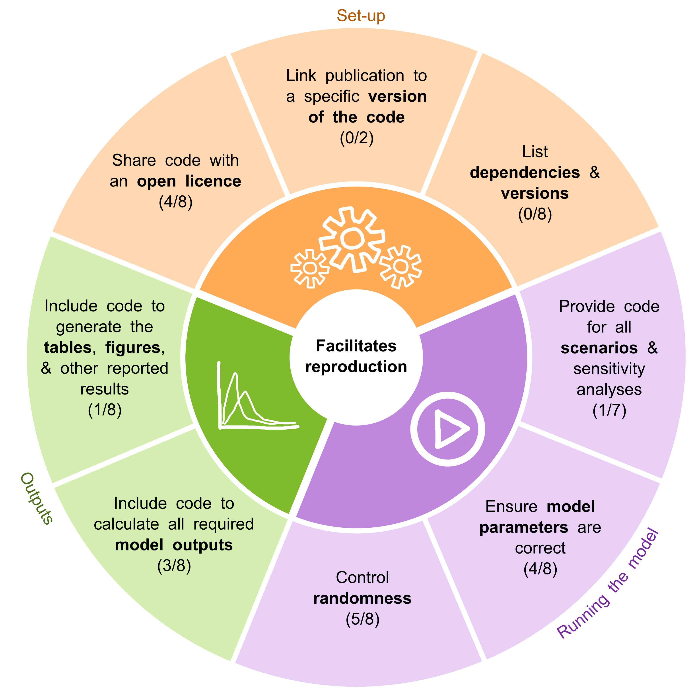

:::

::::

<!----------------------------------------------------------------------------
------------------------------- Next slide -----------------------------------
----------------------------------------------------------------------------->

---

:::: {.columns}

::: {.column width="35%"}

<h2 style="display: inline" data-id="my-heading">How to construct DES as RAP?</h2>

**Resource 2: STARS DES reproducibility recommendations**

:::

::: {.column width="65%"}

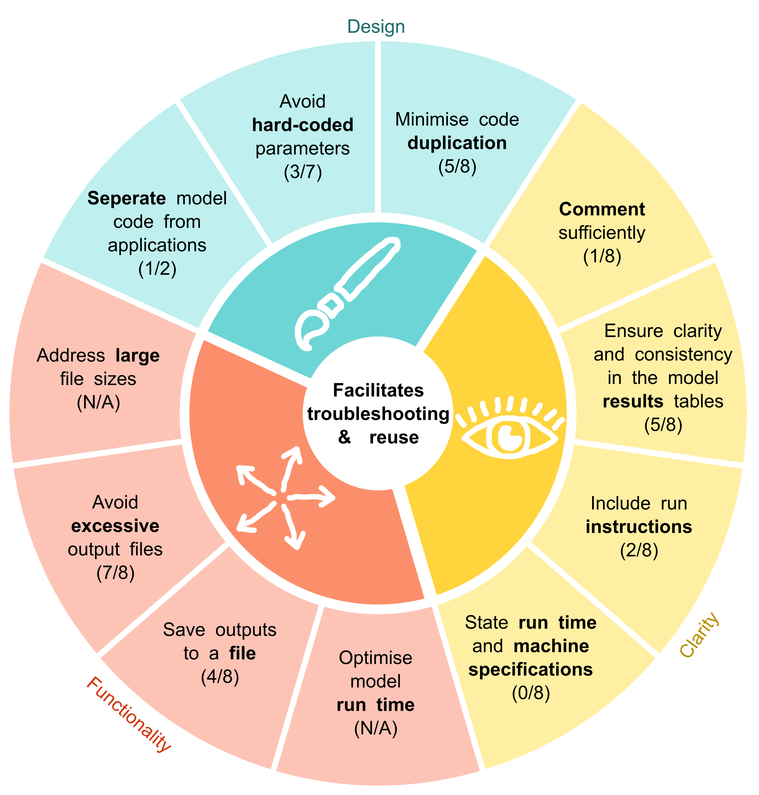

:::

::::

<!----------------------------------------------------------------------------
------------------------------- Next slide -----------------------------------
----------------------------------------------------------------------------->

## DES RAP Book

<iframe width="100%" height="500" src="https://pythonhealthdatascience.github.io/des_rap_book/" title="DES RAP Book"></iframe>

::: {.notes}

* Python and R

:::

<!----------------------------------------------------------------------------
------------------------------- Next slide -----------------------------------
----------------------------------------------------------------------------->

## Version control

**Version control** allows you to track files over time: what changes, when, and by whom.

* Roll back if a change breaks the model.
* Link results to specific versions of code.
* Supports collaboration and sharing.

Most popular: **GitHub**

<!----------------------------------------------------------------------------
------------------------------- Next slide -----------------------------------
----------------------------------------------------------------------------->

## Version control: GitHub

:::: {.columns}

::: {.column}

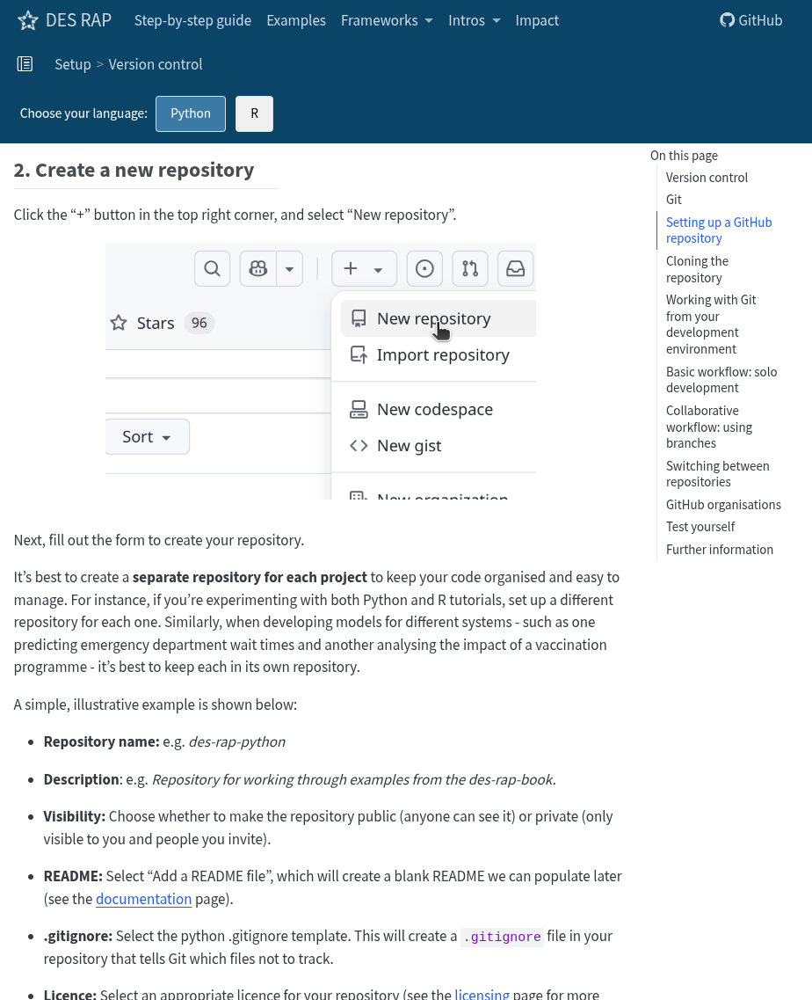

:::

::: {.column}

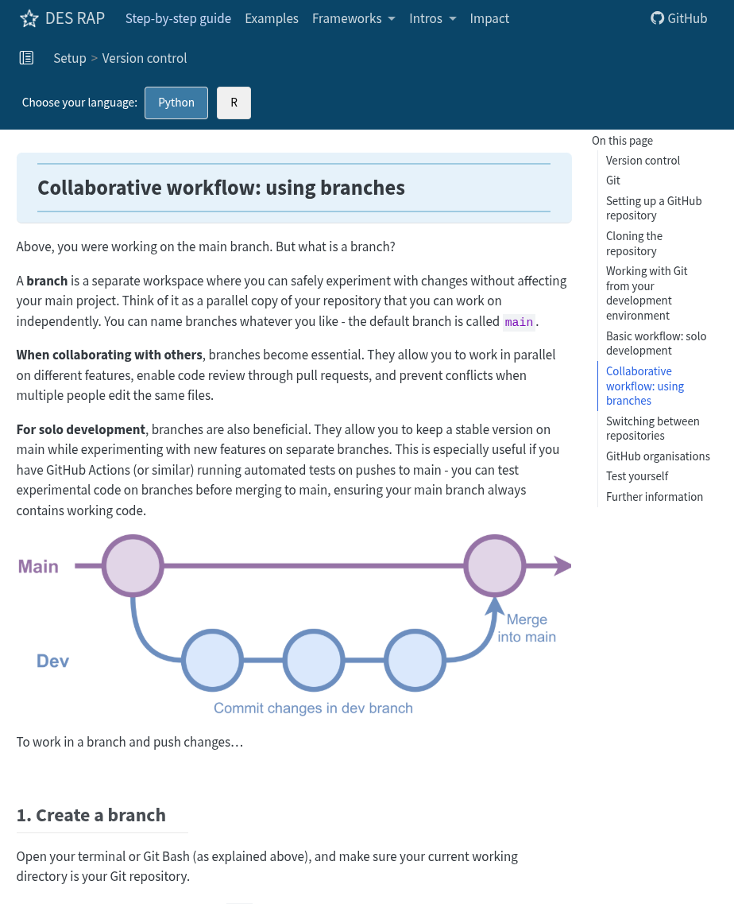

:::

::::

::: {.notes}

* Book walks through how to do this - create a repository, make commits, work in branches, and set up organisations.
* It's best to use GitHub from the start of a project if possible, rather than halfway through.

:::

<!----------------------------------------------------------------------------
------------------------------- Next slide -----------------------------------
----------------------------------------------------------------------------->

## Environments

:::: {.columns}

::: {.column}

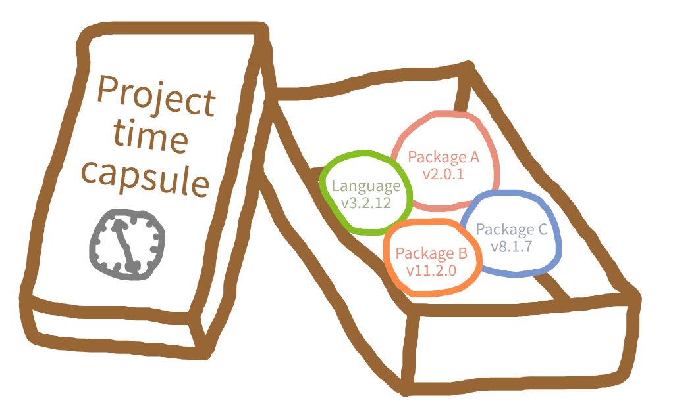{width=90%}

:::

::: {.column}

::: {.fragment}

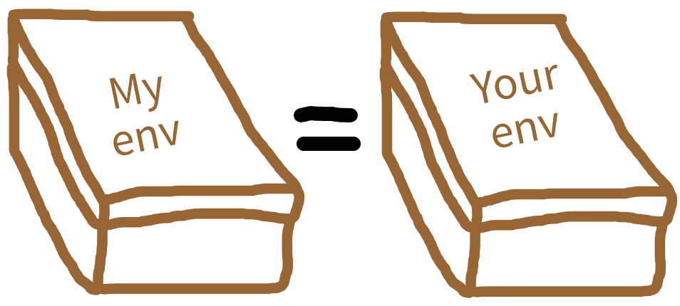

:::

:::

::::

::: {.fragment}

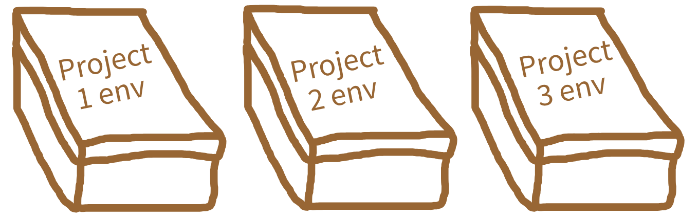{width=70%}

:::

::: {.notes}

Acts like a time capsule, return to project later and run with same packages and version.

Isolate environments for different projects, so each can own set of packages and version of python or R.

Dependency management also important for collaboration, so everyone on team uses same set-up.

:::


<!----------------------------------------------------------------------------
------------------------------- Next slide -----------------------------------
----------------------------------------------------------------------------->

## Environments: Python

::: {style="font-size: 80%"}

| Tool | Python version | Dependency files | Speed |
| - | - | - | - |
| `venv` | ❌ No | `requirements.txt` | ⚡ Fast |
| `conda` | ✅ Yes | `environment.yml` | 🐢 Slow |
| `mamba` | ✅ Yes | `environment.yml` | 🚀 Very fast |
| `poetry` | ⚠️ Partial | `pyproject.toml` & `poetry.lock` | 🐢 Slow |
| `uv` | ✅ Yes | `pyproject.toml` & `uv.lock` | ✅ Yes |

<br>

**Key question:** Does the tool manage the **Python version**?

:::

::: {.notes}

Recommendation? Ideally, managing Python version. So not venv. And ideally conda/mamba/uv. Although poetry good too - it can select among installed versions of Python, but cannot install new Python version itself.

Although disclaimer, NHS audience, know its not always a choice can make, may have own rationale for what choose etc.

In book, we provide instructions on all, but mainly focus on conda/mamba.

:::

<!----------------------------------------------------------------------------
------------------------------- Next slide -----------------------------------
----------------------------------------------------------------------------->

## Environments: Python

:::: {.columns}

::: {.column}

Main packages:

```{.bash}
pandas==2.3.1
plotly==6.3.0
pytest==8.4.1
simpy==4.1.1
```

:::

::: {.column}

Full snapshot:

```{.bash}
exceptiongroup==1.3.1
iniconfig==2.3.0
narwhals==2.22.1
numpy==2.2.6
packaging==26.2
pandas==2.3.1
plotly==6.3.0
pluggy==1.6.0
Pygments==2.20.0
pytest==8.4.1
python-dateutil==2.9.0.post0
pytz==2026.2
simpy==4.1.1
six==1.17.0
tomli==2.4.1
typing_extensions==4.15.0
tzdata==2026.2
```

:::

::::

::: {.notes}

Another thing to consider: main packages v.s., full snapshot

On left are main packages for a project. When set up.. pip install this, pip install that.

On right, is full environment. All dependencies of installed packages and so on.

Reuse/reproduction... broken env... easier with list main... prioritise that... don't just scrape env save... from start, definied key list... etc

:::

<!----------------------------------------------------------------------------
------------------------------- Next slide -----------------------------------
----------------------------------------------------------------------------->

## Environments: R

::: {style="font-size: 80%"}

| Tool | Install + switch between R? | Packages? |
| - | - | - |
| `rig` | ✅ Yes | ❌ No |
| `renv` | ❌ No | ✅ Yes |
| `rv` (in development) | ❌ No | ✅ Yes |

:::

::: {.notes}

rv in development
typically people use renv
renv only manages packages
to manage version, can use rig.

:::

<!----------------------------------------------------------------------------
------------------------------- Next slide -----------------------------------
----------------------------------------------------------------------------->

## Environments: R

:::: {.columns}

::: {.column}

`DESCRIPTION`:

```{.r}
Imports:
    dplyr
    future
```

:::

::: {.column}

`renv.lock`:

```{.r}
{
  "R": {
    "Version": "4.4.1",
    "Repositories": [
      {
        "Name": "CRAN",
        "URL": "https://cloud.r-project.org"
      }
    ]
  },
  "Packages": {
    "dplyr": {
      "Package": "dplyr",
      "Version": "1.1.4",
      "Source": "Repository",
      "Repository": "CRAN",
      "Hash": "aaaaaaaaaaaaaaaaaaaaaaaaaaaaaaaa"
    },
    "future": {
      "Package": "future",
      "Version": "1.34.0",
      "Source": "Repository",
      "Repository": "CRAN",
      "Hash": "bbbbbbbbbbbbbbbbbbbbbbbbbbbbbbbb"
    },
    "cli": {
      "Package": "cli",
      "Version": "3.6.2",
      "Source": "Repository",
      "Repository": "CRAN",
      "Hash": "cccccccccccccccccccccccccccccccc"
    },
    "glue": {
      "Package": "glue",
      "Version": "1.8.0",
      "Source": "Repository",
      "Repository": "CRAN",
      "Hash": "dddddddddddddddddddddddddddddddd"
    },
    "lifecycle": {
      "Package": "lifecycle",
      "Version": "1.0.4",
      "Source": "Repository",
      "Repository": "CRAN",
      "Hash": "eeeeeeeeeeeeeeeeeeeeeeeeeeeeeeee"
    },
    "magrittr": {
      "Package": "magrittr",
      "Version": "2.0.3",
      "Source": "Repository",
      "Repository": "CRAN",
      "Hash": "ffffffffffffffffffffffffffffffff"
    },
    "pillar": {
      "Package": "pillar",
      "Version": "1.9.0",
      "Source": "Repository",
      "Repository": "CRAN",
      "Hash": "11111111111111111111111111111111"
    },
    "rlang": {
      "Package": "rlang",
      "Version": "1.1.4",
      "Source": "Repository",
      "Repository": "CRAN",
      "Hash": "22222222222222222222222222222222"
    },
    "tibble": {
      "Package": "tibble",
      "Version": "3.2.1",
      "Source": "Repository",
      "Repository": "CRAN",
      "Hash": "33333333333333333333333333333333"
    },
    "tidyselect": {
      "Package": "tidyselect",
      "Version": "1.2.1",
      "Source": "Repository",
      "Repository": "CRAN",
      "Hash": "44444444444444444444444444444444"
    },
    "vctrs": {
      "Package": "vctrs",
      "Version": "0.6.5",
      "Source": "Repository",
      "Repository": "CRAN",
      "Hash": "55555555555555555555555555555555"
    },
    "digest": {
      "Package": "digest",
      "Version": "0.6.36",
      "Source": "Repository",
      "Repository": "CRAN",
      "Hash": "66666666666666666666666666666666"
    },
    "globals": {
      "Package": "globals",
      "Version": "0.16.3",
      "Source": "Repository",
      "Repository": "CRAN",
      "Hash": "77777777777777777777777777777777"
    },
    "listenv": {
      "Package": "listenv",
      "Version": "0.9.1",
      "Source": "Repository",
      "Repository": "CRAN",
      "Hash": "88888888888888888888888888888888"
    },
    "parallelly": {
      "Package": "parallelly",
      "Version": "1.38.0",
      "Source": "Repository",
      "Repository": "CRAN",
      "Hash": "99999999999999999999999999999999"
    }
  }
}
```

:::

::::

::: {.notes}

As mentioned in Python

By default using renv, you'll be encourage to take full environment snapshots. renv.lock. that can be really painful to recreate. we encourage DESCRIPTION file list main packages and renv.lock capture all. more info on setting this up in book. but wy?

clear requirements, summary main packages
consistent with package development
alternative for recreation - by default, renv::sync(), using lock, but can run into issues, struggling, may need to rebuild from scratch, could go through scripts and looking at imports, better yet, if already provided in a DESCRIPTION file.

:::

<!----------------------------------------------------------------------------
------------------------------- Next slide -----------------------------------
----------------------------------------------------------------------------->

## Structuring as a package

**Package:** Structured collection of code, data and docs.

Easy to distribute, install and reuse across projects.

<br>

:::: {.columns}

::: {.column style="text-align: center;" .fragment}

Python package:

```text
yourrepository
├── yourpackage
│   ├── __init__.py
│   └── module1.py
└── pyproject.toml
```

:::

::: {.column style="text-align: center;" .fragment}

R package:

```text
yourrepository
├── R
│   └── module1.R
├── DESCRIPTION
├── man/
└── NAMESPACE
```

:::

::::

<!----------------------------------------------------------------------------
------------------------------- Next slide -----------------------------------
----------------------------------------------------------------------------->

## Structuring as a package: why? 

::: {.incremental .show-first}

* Use the model anywhere after install.
* Encourages a standard project structure.
* Separates model and analysis code.
* Improves maintainability and reuse.
* Supports automated testing.
* R: Workflow helps like `usethis` for automatic set-up of licences, READMEs, tests, vignettes, GitHub Actions and more.

:::

::: {.notes}

Benefits:

The model is installed in our environment and can then be easily used anywhere else in our directory (or even from other directories) without needing to specify a system path.

It encourages us to create a well-organised repository following standardised established package structures.

It helps keep the model and analysis code separate, improving maintainability, reusability, and reducing the risk of unintended side effects.

It supports automated testing frameworks which can verify functionality.

R benefits:

Tools like devtools::document() and roxygen2 create documentation that can be accessed using ?functionname.

Workflow helpers like usethis automate setup of licences, READMEs, tests, vignettes, GitHub Actions and more.

:::

<!----------------------------------------------------------------------------
------------------------------- Next slide -----------------------------------
----------------------------------------------------------------------------->

## Structuring as a package: downside

😞: More set-up and learning at the start

::: {.notes}

Downside:

Complexity. Beginners, setting up, lots to learn. For quick, exploratory analyses that won’t be reused or shared, a full package structure may be more effort than necessary. In those cases, a well-organised folder with a few files might be perfectly sufficient. we generally recommend investing the time to adopt a package structure early on - it’s usually easier to start that way, and the benefits tend to outweigh the initial effort.

:::

<!----------------------------------------------------------------------------
------------------------------- Next slide -----------------------------------
----------------------------------------------------------------------------->

## Structuring as a package

:::: {.columns}

::: {.column}

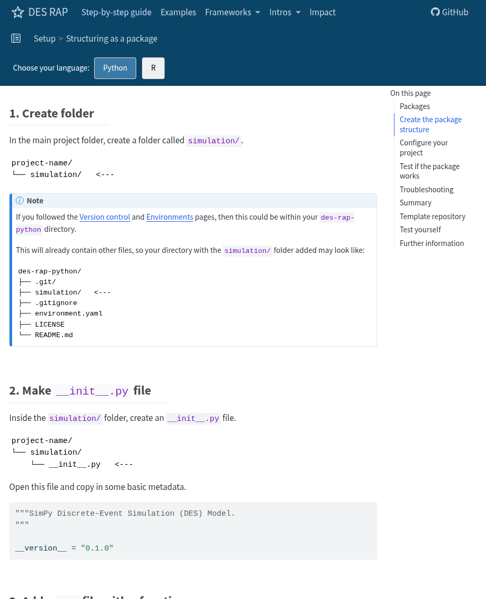

:::

::: {.column}

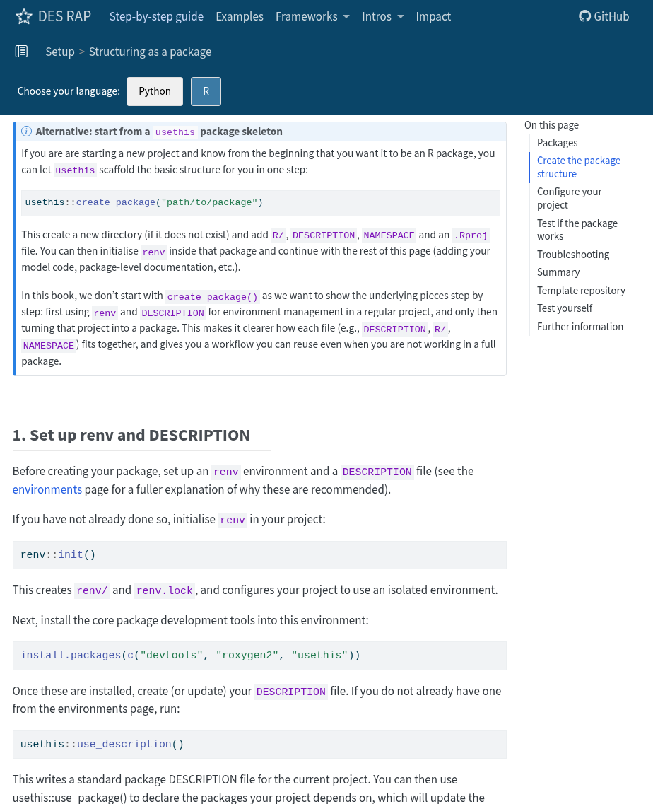

:::

::::

<!----------------------------------------------------------------------------
------------------------------- Next slide -----------------------------------
----------------------------------------------------------------------------->

## Structuring as a package

:::: {.columns}

::: {.column}

[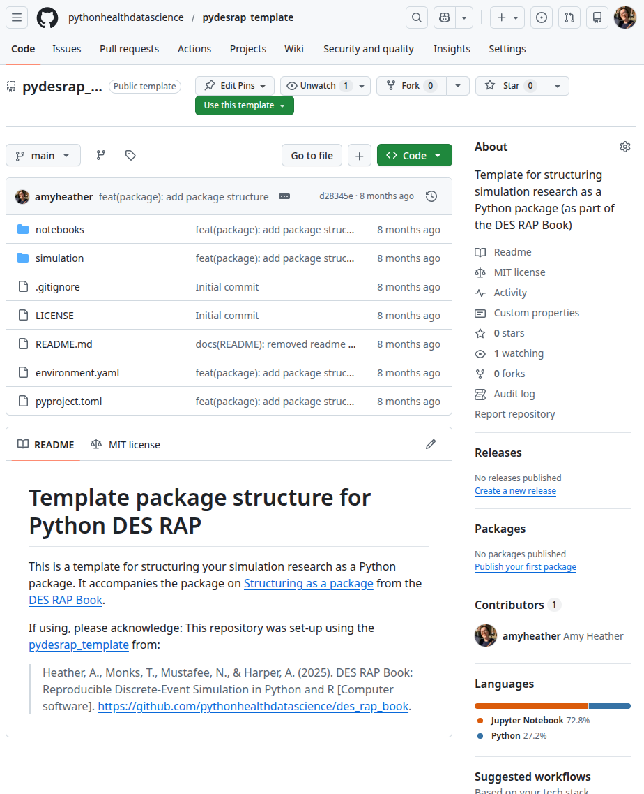](https://github.com/pythonhealthdatascience/pydesrap_template)

:::

::: {.column}

[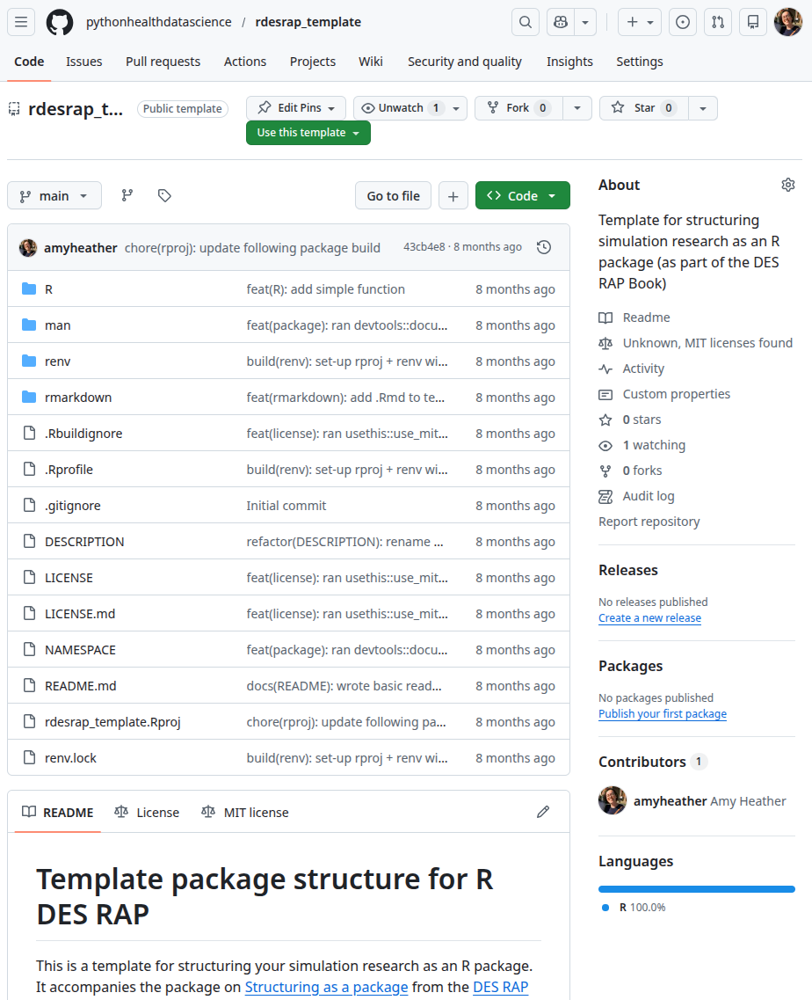](https://github.com/pythonhealthdatascience/rdesrap_template)

:::

::::
