##

::: {style="text-align:center;"}

<h2>Building a Reproducible Analytical Pipeline (RAP) for Simulation with Python and R</h2>

Amy Heather

::: {style="font-size: 60%"}

Postdoctoral Research Associate at the University of Exeter

NHS-OA Webinar 18th June 2026

:::

{width="18%"}
{width="18%"}
{width="25%"}

:::

::: {.notes}

Introduce myself.

Project STARS: "Sharing Tools and Artefacts for Reproducible and Reusable Simulations in healthcare."

Developed resources on building reproducible discrete event healthcare simulation models in Python and R.

Talk: Walk through a full RAP built around DES models in Python and R - focused on simulation, but principles and concepts broadly applicable.

:::

## Reproducibility {auto-animate=true}

:::: {.columns}

::: {.column width=65%}

Reproducibility is the ability to regenerate results (e.g. tables, figures) using the provided code and data.

:::

::::


::: {.notes}

Define reproducibility.

:::

<!----------------------------------------------------------------------------
------------------------------- Next slide -----------------------------------
----------------------------------------------------------------------------->

## Reproducibility {auto-animate=true}

:::: {.columns}

::: {.column width=65%}

Reproducibility is the ability to regenerate results (e.g. tables, figures) using the provided code and data.

:::

::: {.column width=35%}


:::

::::

:::: {.columns}

::: {.column width=20%}

Why?

:::

::: {.column width=80%}

::: {.incremental .show-first}
* Reuse your own work more easily.
* Improve code clarity and quality
* Save time when revisiting analyses.
* Build trust.
* Help others verify and reuse your work.
:::

:::

::::

::: {.notes}

Easier to revisit and reuse own code (e.g., updating outputs, doing new analysis).

---

Aiming for reproducibility encourages you to structure code clearly and document your workflow thoroughly.

---

Troubleshooting non-reproducible code in future can be time-consuming or even impossible when required information is lost.

---

If work is reproducible, it builds trust, as others can independently confirm your results and see that your methods are transparent.

---

When others are able to reproduce your work, it confirms that the code runs correctly as intended. This enables confident reuse and adaption for new contexts and projects.

:::

<!----------------------------------------------------------------------------
------------------------------- Next slide -----------------------------------
----------------------------------------------------------------------------->

## Reproducible Analytical Pipelines

**RAP**: Systematic approach. Every step (end-to-end) is transparent, automated and repeatable.


::: {.notes}

A RAP is a systematic approach to data analysis and modelling in which every step of the process (end-to-end) is transparent, automated, and repeatable

There should be no (or minimal) manual intervention required to generate the results.

Beyond automation, RAPs also will embed software engineering best practices including version control, testing, code review, packaging and documentation.

:::

<!----------------------------------------------------------------------------
------------------------------- Next slide -----------------------------------
----------------------------------------------------------------------------->

## Discrete-event simulation (DES)

DES model a system as a sequence of events. For example, patients arriving, waiting, receiving treatment, and leaving.


::: {.notes}

In this work, we've focused on discrete-event simulation models, or DES.

DES are commonly used to model healthcare systems.

In these models, time progresses only when specific events happen - e.g., a patient arrives, waits for a resource (e.g., doctor), receives treatment, then leaves.

:::

<!----------------------------------------------------------------------------
------------------------------- Next slide -----------------------------------
----------------------------------------------------------------------------->

## Discrete-event simulation (DES) {auto-animate=true}

DES incorporate uncertainty - instead of e.g., fixed frequency of arrivals, sample from statistical distribution.


::: {.notes}

Real systems have uncertainty - patients don’t arrive at exactly the same time, and service durations vary from person to person.

To capture this, instead of having a fixed time between patients or fixed service length, DES models sample from statistical distributions.

:::

<!----------------------------------------------------------------------------
------------------------------- Next slide -----------------------------------
----------------------------------------------------------------------------->

## Discrete-event simulation (DES) {auto-animate=true}

DES incorporate uncertainty - instead of e.g., fixed frequency of arrivals, sample from statistical distribution.

:::: {.columns}

::: {.column}


::: {style="text-align: right;"}

<br>

This means each run <br>
produces different results.

:::

:::

::: {.column}


:::

::::

::: {.notes}

This means each run of the simulation will produce slightly different results.

:::

<!----------------------------------------------------------------------------
------------------------------- Next slide -----------------------------------
----------------------------------------------------------------------------->

## How to construct DES as RAP?

**Resource 1: NHS Levels of RAP**

[](https://nhsdigital.github.io/rap-community-of-practice/introduction_to_RAP/levels_of_RAP/)

::: {.notes}

We used two frameworks to guide us in producing reproducible DES as part of a RAP.

First: the NHS Levels of RAP. Published by RAP Community of Practice. There are three tiers...

:::

<!----------------------------------------------------------------------------
------------------------------- Next slide -----------------------------------
----------------------------------------------------------------------------->

## How to construct DES as RAP?

**Resource 1: NHS Levels of RAP**

::: {style="font-size: 60%"}

**🥉 Baseline** - RAP fundamentals offering resilience against future change.

* Data produced by code in an open-source language (e.g., Python, R).	
* Code is version controlled (see Git basics and using Git collaboratively guides).	
* Repository includes a README.md file (or equivalent) that clearly details steps a user must follow to reproduce the code (use NHS Open Source Policy section on Readmes as a guide).	
* Code has been peer reviewed.	
* Code is published in the open and linked to & from accompanying publication (if relevant).

:::

::: {.notes}

Baseline has things like:

* Using an open source language
* Version control
* README
* Peer review
* Open code

:::

<!----------------------------------------------------------------------------
------------------------------- Next slide -----------------------------------
----------------------------------------------------------------------------->

## How to construct DES as RAP?

**Resource 1: NHS Levels of RAP**

::: {style="font-size: 60%"}

**🥈 Silver** - Implementing best practice by following good analytical and software engineering standards. Meeting all of the 🥉 baseline requirements, plus:

* Outputs are produced by code with minimal manual intervention.	
* Code is well-documented including user guidance, explanation of code structure  methodology and docstrings for functions.	
* Code is well-organised following standard directory format.	
* Reusable functions and/or classes are used where appropriate.	
* Code adheres to agreed coding standards (e.g PEP8, style guide for Pyspark).	
* Pipeline includes a testing framework (unit tests, back tests).	
* Repository includes dependency information (e.g. requirements.txt, PipFile, environment.yml).	
* Logs are automatically recorded by the pipeline to ensure outputs are as expected.	
* Data is handled and output in a Tidy data format.

:::

::: {.notes}

Silver adds things like:

* Running without intervention
* Good documentation
* Well-organised
* Modular code
* Following coding standards
* Writing tests
* Including dependency info
* Saving logs
* Tidy data

:::

<!----------------------------------------------------------------------------
------------------------------- Next slide -----------------------------------
----------------------------------------------------------------------------->

## How to construct DES as RAP?

**Resource 1: NHS Levels of RAP**

::: {style="font-size: 60%"}

**🥇 Gold** - Analysis as a product to further elevate your analytical work and enhance its reusability to the public. Meeting all of the 🥉 baseline and 🥈 silver requirements, plus:

* Code is fully packaged.	
* Repository automatically runs tests etc. via CI/CD or a different integration/deployment tool e.g. GitHub Actions.	
* Process runs based on event-based triggers (e.g., new data in database) or on a schedule.
* Changes to the RAP are clearly signposted. E.g. a changelog in the package, releases etc. (See gov.uk info on Semantic Versioning).

:::

::: {.notes}

Gold tier adds:

* Packaging code
* Using CI/CD like via GitHub actions
* Scheduled runs
* Changelog

:::

<!----------------------------------------------------------------------------
------------------------------- Next slide -----------------------------------
----------------------------------------------------------------------------->

## How to construct DES as RAP?

**Resource 2: STARS DES reproducibility recommendations**

[](https://doi.org/10.1080/17477778.2025.2552177)

::: {.notes}

The second framework used to guide us came from some work we did, published here in the Journal of Simulation.

:::

<!----------------------------------------------------------------------------
------------------------------- Next slide -----------------------------------
----------------------------------------------------------------------------->

## How to construct DES as RAP?

**Resource 2: DES reproducibility recommendations**


::: {.notes}

It involved trying to reproduce eight published Python and R healthcare DES models - with varying success - and recording the facilitators and barriers to reproduction.

:::

<!----------------------------------------------------------------------------
------------------------------- Next slide -----------------------------------
----------------------------------------------------------------------------->

---

:::: {.columns}

::: {.column width="35%"}

<h2 style="display: inline" data-id="my-heading">How to construct DES as RAP?</h2>

**Resource 2: STARS DES reproducibility recommendations**

:::

::: {.column width="65%"}

::: {style="font-size: 70%"}


:::

:::

::::

::: {.notes}

From this we drew up a set of recommendations, specifically targeted to healthcare DES models, and how to make sure they are reproducible. This first circle are those that facilitated reproduction - things like:

* Including a licence
* Dependencies
* Using random seeds
* Ensuring model parameters are correct
* Crucially, sharing all relevant code - for all model outputs, for the scenario analysis, sensitivity analysis, tables, and figures.

:::

<!----------------------------------------------------------------------------
------------------------------- Next slide -----------------------------------
----------------------------------------------------------------------------->

---

:::: {.columns}

::: {.column width="35%"}

<h2 style="display: inline" data-id="my-heading">How to construct DES as RAP?</h2>

**Resource 2: STARS DES reproducibility recommendations**

:::

::: {.column width="65%"}

::: {style="font-size: 70%"}


:::

:::

::::

::: {.notes}

Next, were things that were really helpful when trying to troubleshoot non-reproducible code - things like:

* Avoiding hard-coded parameters
* Minimising code duplication
* Including run instructions
* Ensuring output results tables were clear and easy to understand
* Separating model code from any web applications.

And so on

:::

<!----------------------------------------------------------------------------
------------------------------- Next slide -----------------------------------
----------------------------------------------------------------------------->

## DES RAP Book

<iframe width="100%" height="500" src="https://pythonhealthdatascience.github.io/des_rap_book/" title="DES RAP Book"></iframe>

::: {.notes}

The resource we developed we refer to here as the DES RAP Book. It is a website, openly and freely available online, with the URL at the bottom of this slide.

In it, we provide comprehensive detailed guide which you can follow to gradually build up a working model in Python or in R (show can choose between them).

(Scroll sidebar to see pages).

:::

<!----------------------------------------------------------------------------
------------------------------- Next slide -----------------------------------
----------------------------------------------------------------------------->

## Example models

* Python M/M/s model - <https://github.com/pythonhealthdatascience/pydesrap_mms>
* R M/M/s model - <https://github.com/pythonhealthdatascience/rdesrap_mms>
* Python stroke model - <https://github.com/pythonhealthdatascience/pydesrap_stroke>
* R stroke model - <https://github.com/pythonhealthdatascience/rdesrap_stroke>

::: {.notes}

Alongside this resource are four complete example repositories - two Python, and two R - which serve as illustrative examples following the covered concepts in the book.

:::

<!----------------------------------------------------------------------------
------------------------------- Next slide -----------------------------------
----------------------------------------------------------------------------->

## Focus of this webinar

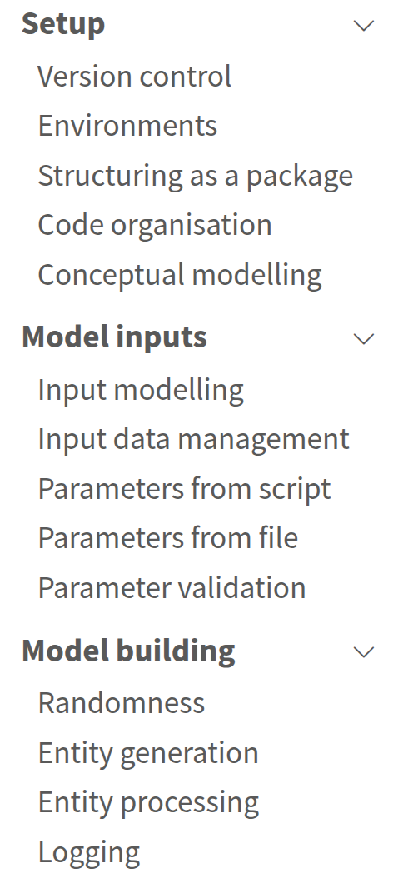{width=30%}
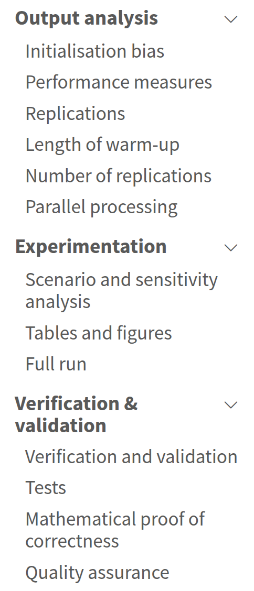{width=30%}
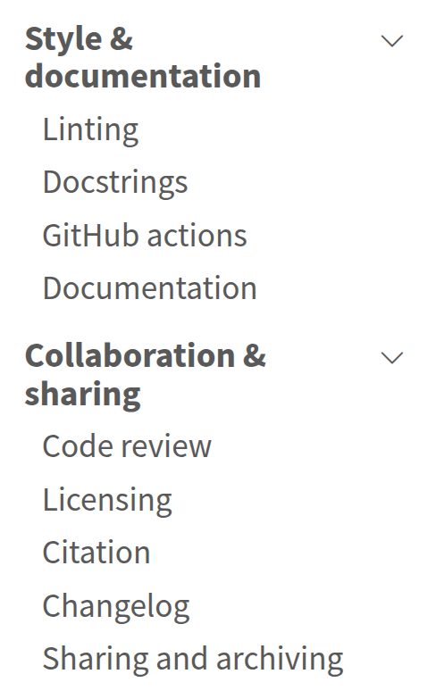{width=30%}

::: {.notes}

In this webinar, I'm going to walk through the topics covered in the book. Though I'll only touch on each briefly, you can go to the book to get a full deep dive and detailed information on each, with code and more explanations.

Aim today is to give a flavour, and if you hear anything and think, ooo, I'd like to learn more about that, everything I mentioned is in the book, so you can go there and learn more about it.

Apologies in advance, it's going to feel like quite a fast-paced talk.

:::

<!----------------------------------------------------------------------------
------------------------------- Next slide -----------------------------------
----------------------------------------------------------------------------->

# Setup

::: {.notes}

Start with project setup.

:::

<!----------------------------------------------------------------------------
------------------------------- Next slide -----------------------------------
----------------------------------------------------------------------------->

## Version control

::: {.pale-gold}

Relevant guidelines:

* NHS Levels of RAP (🥉): Code is version controlled.

:::

::: {.notes}

First is version control, which is a requirement from the baseline tier of the NHS Levels of RAP.

:::

<!----------------------------------------------------------------------------
------------------------------- Next slide -----------------------------------
----------------------------------------------------------------------------->

## Version control

**Version control** allows you to track files over time: what changes, when, and by whom.

* Roll back if a change breaks the model.
* Link results to specific versions of code.
* Supports collaboration and sharing.

Most popular: **GitHub**

<!----------------------------------------------------------------------------
------------------------------- Next slide -----------------------------------
----------------------------------------------------------------------------->

## Version control: GitHub

:::: {.columns}

::: {.column}


:::

::: {.column}


:::

::::

::: {.notes}

In the book, we walk through how to create a repository, make commits, work in branches, and set up organisations.

One thing to mention here, is that it's best to use GitHub from the start of a project if possible, rather than halfway through.

:::

<!----------------------------------------------------------------------------
------------------------------- Next slide -----------------------------------
----------------------------------------------------------------------------->

## Environments

::: {.pale-gold}

Relevant guidelines:

* STARS Reproducibility Recommendations: List dependencies and versions.
* NHS Levels of RAP (🥈): Repository includes dependency information.

:::


::: {.notes}

Environments - requirements of both of the guidelines we followed.

:::

<!----------------------------------------------------------------------------
------------------------------- Next slide -----------------------------------
----------------------------------------------------------------------------->

## Environments

:::: {.columns}

::: {.column}

{width=90%}

:::

::: {.column}

::: {.fragment}


:::

:::

::::

::: {.fragment}

{width=70%}

:::

::: {.notes}

Why?

Acts like a time capsule, return to project later and run with same packages and version.

---

Dependency management also important for collaboration, so everyone on team uses same set-up.

---

Isolate environments for different projects, so each can own set of packages and version of python or R.

:::


<!----------------------------------------------------------------------------
------------------------------- Next slide -----------------------------------
----------------------------------------------------------------------------->

## Environments: Python

::: {style="font-size: 80%"}

| Tool | Python version | Dependency files | Speed |
| - | - | - | - |
| `venv` | ❌ No | `requirements.txt` | ⚡ Fast |
| `conda` | ✅ Yes | `environment.yml` | 🐢 Slow |
| `mamba` | ✅ Yes | `environment.yml` | 🚀 Very fast |
| `poetry` | ⚠️ Partial | `pyproject.toml` & `poetry.lock` | 🐢 Slow |
| `uv` | ✅ Yes | `pyproject.toml` & `uv.lock` | ✅ Yes |

<br>

**Key question:** Does the tool manage the **Python version**?

:::

::: {.notes}

In Python, there are lots of options, including `venv`, `conda`, `mamba`, `poetry`, `uv`, and more.

I know in the NHS there may not be alot of flexibility for what tool you can use.

Our general recommendation if you do get a choice is to use something that will manage Python versions - something like `conda`, `mamba`, and `uv`. `poetry` is also good as it can select among installed versions of Python, though cannot install new versions itself. This is good, as it means you can have different specific versions of Python for different projects.

On our team, we typically use `conda`/`mamba`.

:::

<!----------------------------------------------------------------------------
------------------------------- Next slide -----------------------------------
----------------------------------------------------------------------------->

## Environments: Python

:::: {.columns}

::: {.column}

Main packages:

```{.bash}
pandas==2.3.1
plotly==6.3.0
pytest==8.4.1
simpy==4.1.1
```

:::

::: {.column}

Full snapshot:

```{.bash}
exceptiongroup==1.3.1
iniconfig==2.3.0
narwhals==2.22.1
numpy==2.2.6
packaging==26.2
pandas==2.3.1
plotly==6.3.0
pluggy==1.6.0
Pygments==2.20.0
pytest==8.4.1
python-dateutil==2.9.0.post0
pytz==2026.2
simpy==4.1.1
six==1.17.0
tomli==2.4.1
typing_extensions==4.15.0
tzdata==2026.2
```

:::

::::

::: {.notes}

Another thing to consider is whether you are recording the main packages used or a full snapshot of your environment.

On the left, are the main packages - when setting up, pip install this, pip install right.

On right, is the full environment, with all the dependencies of those four packages included. Might get this by running `pip freeze`.

We would encourage ensuring there is a list of main packages, as this makes it much easier to recover from problems: if recreating the full environment fails, you can start from a clean environment and reinstall just the main packages, letting the dependency resolver work things out again.

With `conda` or `mamba` you might often just have a file like the left. With `poetry` and `uv`, you will often have both.

:::

<!----------------------------------------------------------------------------
------------------------------- Next slide -----------------------------------
----------------------------------------------------------------------------->

## Environments: R

::: {style="font-size: 80%"}

| Tool | Install + switch between R? | Packages? |
| - | - | - |
| `rig` | ✅ Yes | ❌ No |
| `renv` | ❌ No | ✅ Yes |
| `rv` (in development) | ❌ No | ✅ Yes |

:::

::: {.notes}

In R, there is one main package used for managing installed packages, and that is `renv`.

For installing and switching between R versions, we would recommend `rig`.

Also to flag, a new package being developed as an alternative to `renv` called `rv`.

:::

<!----------------------------------------------------------------------------
------------------------------- Next slide -----------------------------------
----------------------------------------------------------------------------->

## Environments: R

:::: {.columns}

::: {.column}

`DESCRIPTION`:

```{.r}
Imports:
    dplyr
    future
```

:::

::: {.column}

`renv.lock`:

```{.r}
{
  "R": {
    "Version": "4.4.1",
    "Repositories": [
      {
        "Name": "CRAN",
        "URL": "https://cloud.r-project.org"
      }
    ]
  },
  "Packages": {
    "dplyr": {
      "Package": "dplyr",
      "Version": "1.1.4",
      "Source": "Repository",
      "Repository": "CRAN",
      "Hash": "aaaaaaaaaaaaaaaaaaaaaaaaaaaaaaaa"
    },
    "future": {
      "Package": "future",
      "Version": "1.34.0",
      "Source": "Repository",
      "Repository": "CRAN",
      "Hash": "bbbbbbbbbbbbbbbbbbbbbbbbbbbbbbbb"
    },
    "cli": {
      "Package": "cli",
      "Version": "3.6.2",
      "Source": "Repository",
      "Repository": "CRAN",
      "Hash": "cccccccccccccccccccccccccccccccc"
    },
    "glue": {
      "Package": "glue",
      "Version": "1.8.0",
      "Source": "Repository",
      "Repository": "CRAN",
      "Hash": "dddddddddddddddddddddddddddddddd"
    },
    "lifecycle": {
      "Package": "lifecycle",
      "Version": "1.0.4",
      "Source": "Repository",
      "Repository": "CRAN",
      "Hash": "eeeeeeeeeeeeeeeeeeeeeeeeeeeeeeee"
    },
    "magrittr": {
      "Package": "magrittr",
      "Version": "2.0.3",
      "Source": "Repository",
      "Repository": "CRAN",
      "Hash": "ffffffffffffffffffffffffffffffff"
    },
    "pillar": {
      "Package": "pillar",
      "Version": "1.9.0",
      "Source": "Repository",
      "Repository": "CRAN",
      "Hash": "11111111111111111111111111111111"
    },
    "rlang": {
      "Package": "rlang",
      "Version": "1.1.4",
      "Source": "Repository",
      "Repository": "CRAN",
      "Hash": "22222222222222222222222222222222"
    },
    "tibble": {
      "Package": "tibble",
      "Version": "3.2.1",
      "Source": "Repository",
      "Repository": "CRAN",
      "Hash": "33333333333333333333333333333333"
    },
    "tidyselect": {
      "Package": "tidyselect",
      "Version": "1.2.1",
      "Source": "Repository",
      "Repository": "CRAN",
      "Hash": "44444444444444444444444444444444"
    },
    "vctrs": {
      "Package": "vctrs",
      "Version": "0.6.5",
      "Source": "Repository",
      "Repository": "CRAN",
      "Hash": "55555555555555555555555555555555"
    },
    "digest": {
      "Package": "digest",
      "Version": "0.6.36",
      "Source": "Repository",
      "Repository": "CRAN",
      "Hash": "66666666666666666666666666666666"
    },
    "globals": {
      "Package": "globals",
      "Version": "0.16.3",
      "Source": "Repository",
      "Repository": "CRAN",
      "Hash": "77777777777777777777777777777777"
    },
    "listenv": {
      "Package": "listenv",
      "Version": "0.9.1",
      "Source": "Repository",
      "Repository": "CRAN",
      "Hash": "88888888888888888888888888888888"
    },
    "parallelly": {
      "Package": "parallelly",
      "Version": "1.38.0",
      "Source": "Repository",
      "Repository": "CRAN",
      "Hash": "99999999999999999999999999999999"
    }
  }
}
```

:::

::::

::: {.notes}

In R, you again want to think about main packages v.s. full snapshot.

By default using `renv`, you'll be encouraged to take full environment snapshots in an `renv.lock` file. That can be painful to rebuild in future, so in the book, we recommend also keeping a `DESCRIPTION` file listing the main packages.

:::

<!----------------------------------------------------------------------------
------------------------------- Next slide -----------------------------------
----------------------------------------------------------------------------->

## Structuring as a package

::: {.pale-gold}

Relevant guidelines:

* NHS Levels of RAP (🥈): Code is well-organised following standard directory format.
* NHS Levels of RAP (🥇): Code is fully packaged.

:::

::: {.notes}

When setting up the structure of a repository, it's worth considering structuring your code as a package, as recommended in the NHS Levels of RAP.

:::

<!----------------------------------------------------------------------------
------------------------------- Next slide -----------------------------------
----------------------------------------------------------------------------->

## Structuring as a package

**Package:** Structured collection of code, data and docs.

Easy to distribute, install and reuse across projects.

<br>

:::: {.columns}

::: {.column style="text-align: center;" .fragment}

Python package:

```text
yourrepository
├── yourpackage
│   ├── __init__.py
│   └── module1.py
└── pyproject.toml
```

:::

::: {.column style="text-align: center;" .fragment}

R package:

```text
yourrepository
├── R
│   └── module1.R
├── DESCRIPTION
├── man/
└── NAMESPACE
```

:::

::::


::: {.notes}

It may sound scary, but a package is basically just a standardised, structured collection of code, documentation and data, that is easy to distribute, install and reuse.

---

In Python, the key files required for a package are:

* Folder with `.py` file containing code (known as a module).
* An `__init__.py` file marking that folder as a package.
* A `pyproject.toml` containing package information.

---

In R, a package has four key components:

* A folder called `R/` containing one or more `.R` files with code.
* A `DESCRIPTION` file containing information about the package.
* A `man/` folder, which is automatically generated by `roxygen2` and contains help files based on your package docstrings, which I'll mention later.
* A `NAMESPACE` file, automatically generated and contains all the functions and objects made available by your package.

:::

<!----------------------------------------------------------------------------
------------------------------- Next slide -----------------------------------
----------------------------------------------------------------------------->

## Structuring as a package: why? 

::: {.incremental .show-first}

* Use the model anywhere after install.
* Encourages a standard project structure.
* Separates model and analysis code.
* Improves maintainability and reuse.
* Supports automated testing.
* R: Workflow helps like `usethis` for automatic set-up of licences, READMEs, tests, vignettes, GitHub Actions and more.

:::

::: {.notes}

The model is installed in our environment and can then be easily used anywhere else in our directory (or even from other directories) without needing to specify a system path.

---

It encourages us to create a well-organised repository following standardised established package structures.

---

It helps keep the model and analysis code separate.

---

Improves maintainability and reusability.

---

It supports automated testing frameworks which can verify functionality.

---

In R, workflow helpers like `usethis` automate setup of licences, READMEs, tests, vignettes, GitHub Actions and more.

:::

<!----------------------------------------------------------------------------
------------------------------- Next slide -----------------------------------
----------------------------------------------------------------------------->

## Structuring as a package: downside

😞: More set-up and learning at the start

::: {.notes}

Downside: Complexity.

Particularly for beginners, setting up, there's a lot to learn.

For quick, exploratory analyses that won’t be reused or shared, a full package structure may be more effort than necessary. In those cases, a well-organised folder with a few files might be perfectly sufficient.

For analyses where we might want a package structure, we generally recommend investing the time to adopt a package structure early on - it’s usually easier to start that way, and the benefits tend to outweigh the initial effort.

:::

<!----------------------------------------------------------------------------
------------------------------- Next slide -----------------------------------
----------------------------------------------------------------------------->

## Structuring as a package

:::: {.columns}

::: {.column}


:::

::: {.column}


:::

::::

::: {.notes}

In the walk, we walk and guide step-by-step through creating a package and then using functions from that package in a notebook or R markdown file.

:::

<!----------------------------------------------------------------------------
------------------------------- Next slide -----------------------------------
----------------------------------------------------------------------------->

## Structuring as a package

:::: {.columns}

::: {.column}

[](https://github.com/pythonhealthdatascience/pydesrap_template)

:::

::: {.column}

[](https://github.com/pythonhealthdatascience/rdesrap_template)

:::

::::

::: {.notes}

We also provide and link out to template repositories - one for Python and one for R - which contain the complete package structure required, making set-up of a package structure a little easier.

:::

<!----------------------------------------------------------------------------
------------------------------- Next slide -----------------------------------
----------------------------------------------------------------------------->

## Code organisation

::: {.pale-gold}

Relevant guidelines:

* STARS Reproducibility Recommendations: Minimise code duplication.
* NHS Levels of RAP (🥈): Reusable functions and/or classes are used where appropriate.

:::

::: {.notes}

The guidelines recommend avoiding code duplication and uses functions or classes where possible.

:::

<!----------------------------------------------------------------------------
------------------------------- Next slide -----------------------------------
----------------------------------------------------------------------------->

## Code organisation

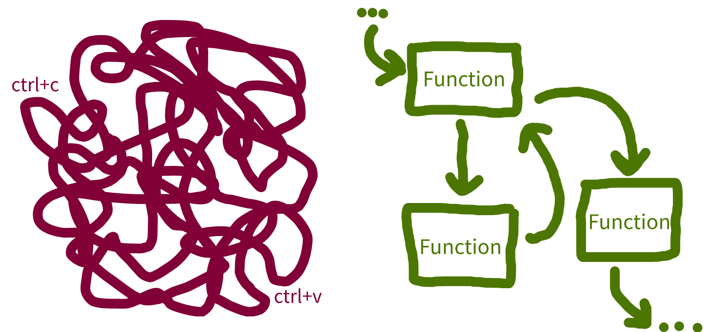

::: {.notes}

We want to avoiding having all code in one script and copying and pasting things and so on. It's better to organise code into functions and classes.

This means code is modular - with each component (e.g., function) focused on a specific task.

It makes code easier to read and collaborate on, simpler to maintain, and reduces duplication.

:::

<!----------------------------------------------------------------------------
------------------------------- Next slide -----------------------------------
----------------------------------------------------------------------------->

## Code organisation: functions

:::: {.columns}

::: {.column}

Python:

::: {style="font-size: 0.7em;"}

```{.python}
def estimate_wait_time(queue_length, avg_service_time):
    """
    Estimate the total wait time in a queue.

    Parameters
    ----------
    queue_length : int
        Number of people currently ahead in the queue.
    avg_service_time : float
        Average service time per person.

    Returns
    -------
    float
        Estimated total wait time.
    """
    return queue_length * avg_service_time


# There are 4 patients ahead, average service time is 15 minutes
print(estimate_wait_time(queue_length=4, avg_service_time=15))
```

:::

:::

::: {.column}

R:

::: {style="font-size: 0.7em;"}

```{.r}
#' Estimate the total wait time in a queue.
#'
#' @param queue_length Numeric. Number of people currently ahead in the queue.
#' @param avg_service_time Numeric. Average service time per person.
#'
#' @return Estimated total wait time.
#' @export

estimate_wait_time <- function(queue_length, avg_service_time) {
  queue_length * avg_service_time
}

# There are 4 patients ahead
# Average service time is 15 minutes
print(
  estimate_wait_time(
    queue_length = 4L, avg_service_time = 15L
  )
)
```

:::

:::

::::

::: {.notes}

Functions are one way to do this which you've likely come across and written before.

You define input parameters, a sequence of steps, and the return output values. Here, are very simple examples estimating wait time from queue length and service time.

:::

<!----------------------------------------------------------------------------
------------------------------- Next slide -----------------------------------
----------------------------------------------------------------------------->

## Code organisation: classes (Python)

::: {style="font-size: 0.7em;"}

```{.python}
class Patient:
    """
    Represents a patient in a healthcare system queue.

    Attributes
    ----------
    patient_id : int
        Unique identifier for the patient.
    arrival_time : float
        Recorded arrival time for the patient.
    status : str
        Current status of the patient.
    """
    def __init__(self, patient_id, arrival_time):
        """
        Initialise a new Patient instance.

        Parameters
        ----------
        patient_id : int
            Unique identifier for the patient.
        arrival_time : float
            Recorded arrival time for the patient.
        """
        self.patient_id = patient_id
        self.arrival_time = arrival_time
        self.status = "waiting"

    def admit(self):
        """
        Mark the patient as admitted.
        """
        self.status = "admitted"

    def discharge(self):
        """
        Mark the patient as discharged.
        """
        self.status = "discharged"


alice = Patient(patient_id=1, arrival_time=3)
print(alice.status)
```

:::

::: {.notes}

Classes may be less familiar.

Using classes is referred to as object-oriented programming.

They're common in Python, but less often used in R.

Classes bundle together data (attributes) and behaviour (methods). They're useful when you:

* Need to keep track of state - remembering information about an object over time, like a patient and their ID, type, times.
* Also, when you have several related functions operating on the same kind of data, can go all in one class.

:::

<!----------------------------------------------------------------------------
------------------------------- Next slide -----------------------------------
----------------------------------------------------------------------------->

# Model inputs

::: {.notes}

In this next bit, I'll touch on some of the more DES-specific content in the book, starting with model inputs.

:::

<!----------------------------------------------------------------------------
------------------------------- Next slide -----------------------------------
----------------------------------------------------------------------------->

## Input modelling {auto-animate=true}

Sample from distributions in DES. To choose:

::: {.incremental}

1. Identify candidate distributions.
2. Fit distributions to your data and compare goodness-of-fit.

:::

::: {.fragment}

Recommend: `distfit` (Python) and `fitdistrplus` (R)

:::

::: {.notes}

As mentioned, DES models sample from distributions, and the process of choosing those distributions is called input modelling. It has two key steps.

---

1. Identify candidate distributions, based on your knowledge of the real process and visual inspection of the data, choosing plausible and contextually appropriate distributions.

---

2. Fit distributions to your data and compare goodness-of-fit.

---

For step 2, we recommend the packages `distfit` and `fitdistrplus`.

:::

<!----------------------------------------------------------------------------
------------------------------- Next slide -----------------------------------
----------------------------------------------------------------------------->

## Input modelling {auto-animate=true}

Recommend: `distfit` (Python) and `fitdistrplus` (R)

:::: {.columns}

::: {.column}

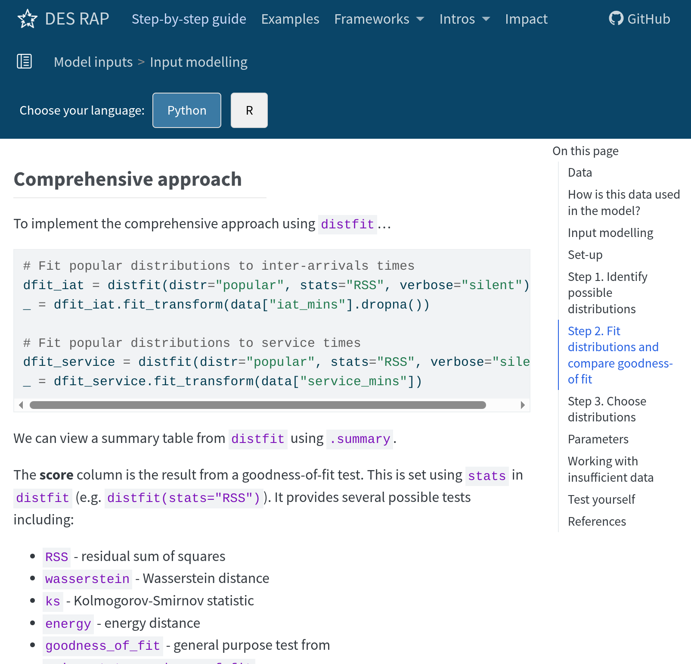

:::

::: {.column}

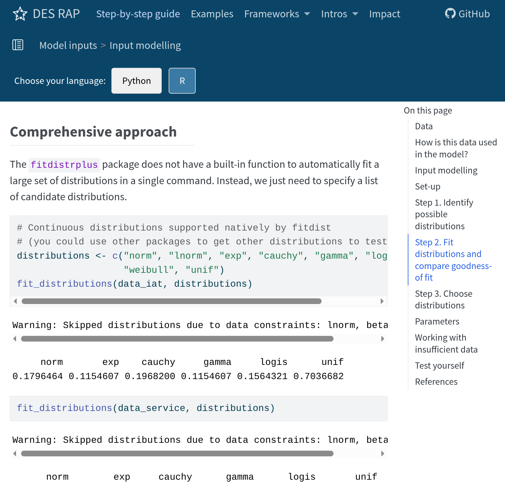

:::

::::

::: {.notes}

In the book, we show how to use them.

:::

<!----------------------------------------------------------------------------
------------------------------- Next slide -----------------------------------
----------------------------------------------------------------------------->

## Input modelling {auto-animate=true}

Recommend: `distfit` (Python) and `fitdistrplus` (R)

:::: {.columns}

::: {.column}

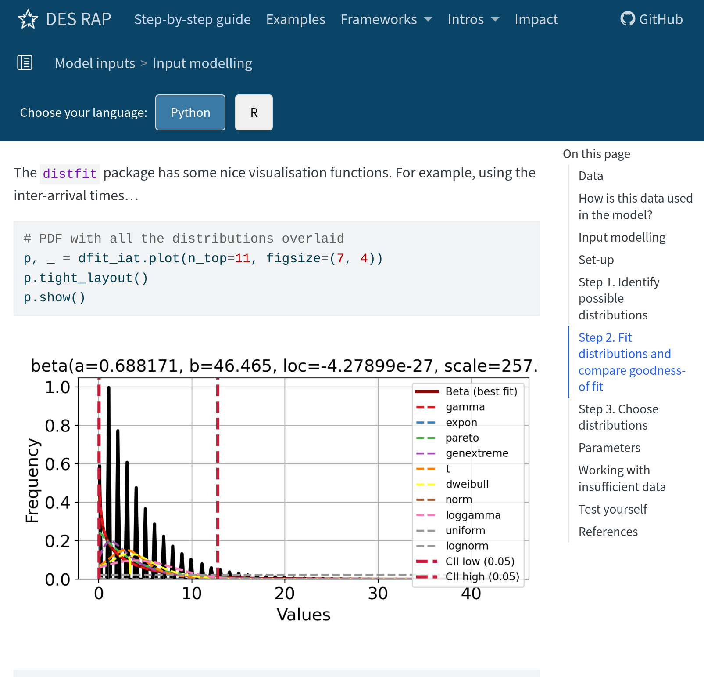

:::

::: {.column}

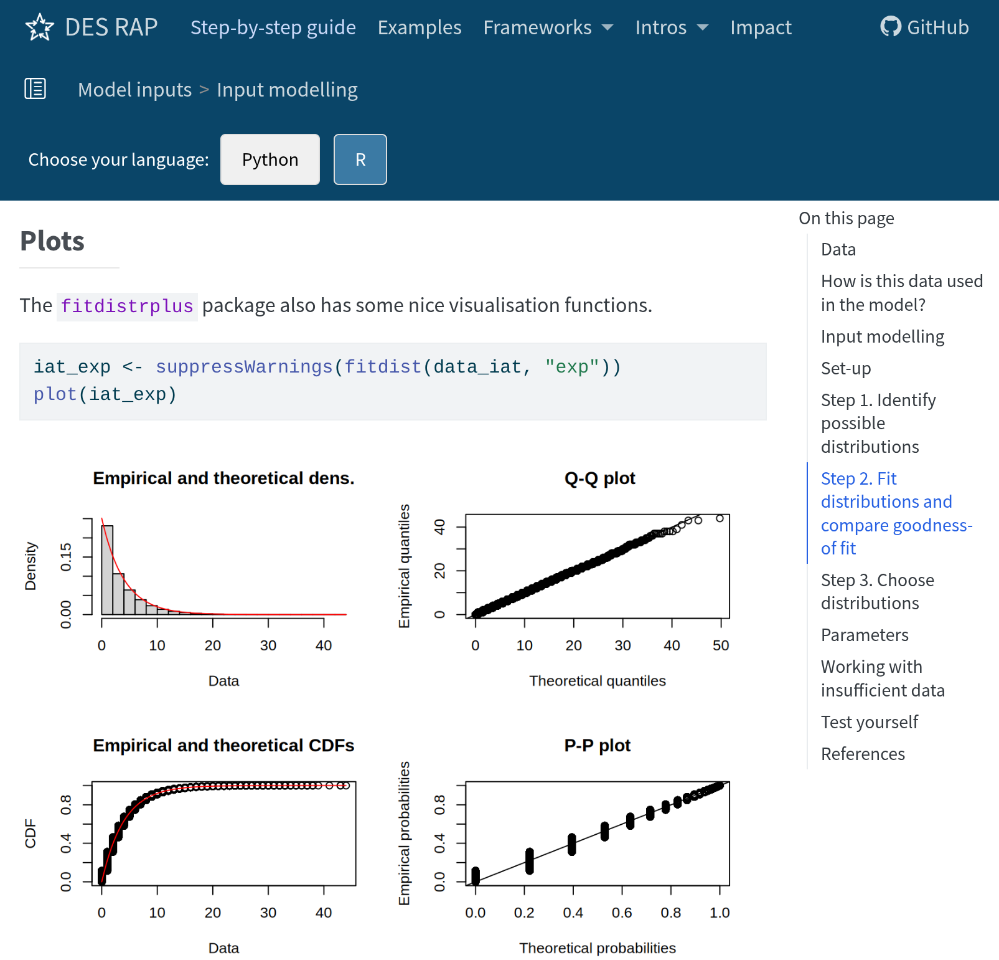

:::

::::

::: {.notes}

Both have lots of functiality like creating various figures around goodness-of-fit.

:::

<!----------------------------------------------------------------------------
------------------------------- Next slide -----------------------------------
----------------------------------------------------------------------------->

## Input data management

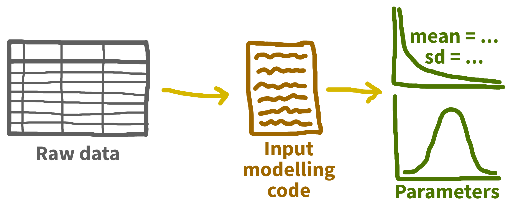

::: {.notes}

When input modelling, we have three key components: raw data, input modelling code, and the chosen distributions and their parameters.

:::

<!----------------------------------------------------------------------------
------------------------------- Next slide -----------------------------------
----------------------------------------------------------------------------->

## Input data management

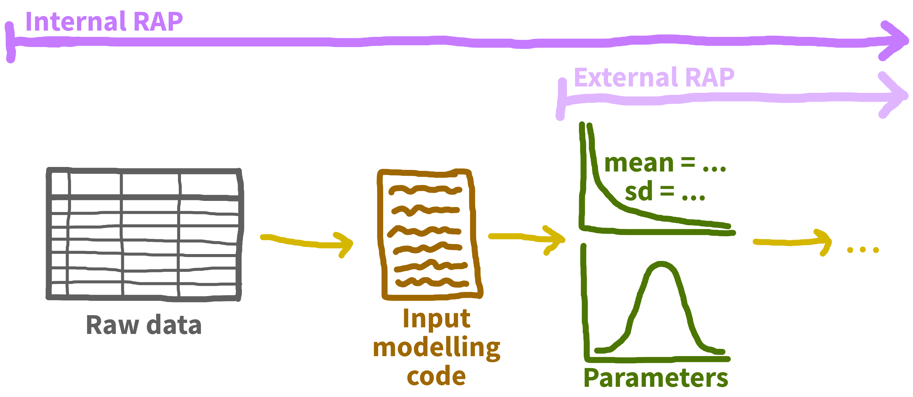

::: {.notes}

A RAP is end-to-end, but some of this information may - or will definitely - be private and sensitive, and cannot be shared.

Internally, it's important to have a RAP that works right from scratch, from raw data.

But what you share might be different - e.g., just sharing parameters, or actually sharing only synthetic parameters.

:::

<!----------------------------------------------------------------------------
------------------------------- Next slide -----------------------------------
----------------------------------------------------------------------------->

## Parameters

::: {.pale-gold}

Relevant guidelines:

* STARS Reproducibility Recommendations: Avoid hard-coded parameters.

:::

::: {.notes}

In the model code, we want to avoid hard-coding parameters.

:::

<!----------------------------------------------------------------------------
------------------------------- Next slide -----------------------------------
----------------------------------------------------------------------------->

## Parameters

**What not to do:** hardcoding parameters into model code.

:::: {.columns}

::: {style="font-size: 0.8em;"}

::: {.column width="47%"}

```{.python}
def model():
    # Hardcoded parameter values
    interarrival_time = 5
    consultation_time = 20
    transfer_prob = 0.3
    # ...rest of the model...
```

:::

::: {.column width="5%"}

:::

::: {.column width="47%"}

```{.r}
model <- function() {
    # Hardcoded parameter values
    interarrival_time <- 5
    consultation_time <- 20
    transfer_prob <- 0.3
    # ...rest of the model...
}
```

:::

:::

::::

::: {.fragment}

* Requires manually changing parameter values in the script.
* May end up with duplicate scripts.

:::

::: {.notes}

So this means like hard coding them into the model functions themselves.

---

It makes it really hard to change values, meaning you need to manually edit scripts, or to run scenarios, you might end up with duplicate scripts with different values.

:::

<!----------------------------------------------------------------------------
------------------------------- Next slide -----------------------------------
----------------------------------------------------------------------------->

## Parameters

**A slight improvement:** global parameters.

:::: {.columns}

::: {style="font-size: 0.8em;"}

::: {.column width="47%"}

```{.python}
# Parameters for base case
INTERARRIVAL_TIME = 5
CONSULTATION_TIME = 20
TRANSFER_PROB = 0.3

def model():
    # Use the global parameters
    # ...
```

:::

::: {.column width="5%"}

:::

::: {.column width="47%"}

```{.r}
# Parameters for base case
interarrival_time <- 5
consultation_time <- 20
transfer_prob <- 0.3

model <- function() {
  # Use the global parameters
  # ...
}
```

:::

:::

::::

::: {.fragment}

* ✅ No longer hard coded.
* ✅ Centralised.

:::

::: {.fragment}

* ❌ Still inflexible.
* ❌ Not scalabale.

:::

::: {.notes}

Global parameters are slightly better. These are no longer hidden in code, but are all defined at the start of the script.

---

They exist outside the model logic, all in one place.

---

However, they are still difficult to change for scenarios, and can become quite messy when there are lots of parameters.

:::

<!----------------------------------------------------------------------------
------------------------------- Next slide -----------------------------------
----------------------------------------------------------------------------->

## Parameters

**Recommendation:**

1. Group parameters into a dedicated object.
2. Pass this object explicitly to your model.

::: {.fragment}

* ✅ Clear parameter sets.
* ✅ No global variables.
* ✅ Fewer inputs.

:::

::: {.fragment}

Either within script or from a file.

Wide range of possibilities. Some examples...

:::

::: {.notes}

We recommend it is better to have all parameters grouped in a dedicated object, and to pass that object explicitly to the model.

---

This means each scenario has its own object with all the parameters needed. We have no global variables, so we don't accidentally reuse old parameters in new scenarios. And we have fewer inputs, if we can pass all our parameters as a single object input to our model.

---

We explore lots of possible ways to do this, both within scripts or importing from data files. Some examples...

:::

<!----------------------------------------------------------------------------
------------------------------- Next slide -----------------------------------
----------------------------------------------------------------------------->

## Parameters

Python class example:

::: {style="font-size: 0.8em;"}

```{.python}
class Parameters:
    """
    Parameter class.
    """
    def __init__(
        self, interarrival_time=5, consultation_time=20, transfer_prob=0.3
    ):
        """
        Initialise Parameters instance.

        Parameters
        ----------
        interarrival_time : float
            Time between arrivals (minutes).
        consultation_time : float
            Length of consultation (minutes).
        transfer_prob : float
            Transfer probability (0-1).
        """
        self.interarrival_time = interarrival_time
        self.consultation_time = consultation_time
        self.transfer_prob = transfer_prob
```

:::

::: {.notes}

Here, a Python example with parameters defined as attributes in a class.

:::

<!----------------------------------------------------------------------------
------------------------------- Next slide -----------------------------------
----------------------------------------------------------------------------->

## Parameters

Python JSON example:

:::: {.columns}

::: {.column width="40%"}

::: {style="font-size: 0.6em;"}

```{.json}
{
   "simulation_parameters": {
      "adult_interarrival": {
         "class_name": "Exponential",
         "params": {
            "mean": 5.0
         }
      },
      "adult_consultation": {
         "class_name": "Exponential",
         "params": {
            "mean": 20.0
         }
      },
      "adult_transfer": {
         "class_name": "Exponential",
         "params": {
            "mean": 0.3
         }
      },
      "child_interarrival": {
         "class_name": "Exponential",
         "params": {
            "mean": 7.0
         }
      },
      "child_consultation": {
         "class_name": "Exponential",
         "params": {
            "mean": 15.0
         }
      },
      "child_transfer": {
         "class_name": "Exponential",
         "params": {
            "mean": 0.2
         }
      },
      "elderly_interarrival": {
         "class_name": "Exponential",
         "params": {
            "mean": 10.0
         }
      },
      "elderly_consultation": {
         "class_name": "Exponential",
         "params": {
            "mean": 30.0
         }
      },
      "elderly_transfer": {
         "class_name": "Exponential",
         "params": {
            "mean": 0.5
         }
      }
   }
}
```

:::

:::

::: {.column width="60%"}

::: {style="font-size: 0.7em;"}

```{.python}
class CreateParameters:
    """
    Store simulation parameters, combining those loaded from a JSON file with
    values defined in the class.
    """
    def __init__(self, json_file, number_of_runs=10):
        """
        Parameters
        ----------
        json_file : str
            Path to JSON file containing simulation parameters.
        number_of_runs : int, optional
            Number of simulation runs (default is 10).
        """
        # Import parameters from JSON file
        with open(json_file, "r", encoding="utf-8") as f:
            json_content = json.load(f)
        params = json_content["simulation_parameters"]

        # Assign file-based parameters as attributes
        for key, value in params.items():
            setattr(self, key, value)

        # Add class-defined parameters
        self.number_of_runs = number_of_runs


param = CreateParameters(os.path.join(data_path, "example_parameters.json"))
```

:::

:::

::::

::: {.notes}

Here, more complex nested parameters stored in a JSON file, and imported by a class.

:::

<!----------------------------------------------------------------------------
------------------------------- Next slide -----------------------------------
----------------------------------------------------------------------------->

## Parameter validation

Either separate function or part of class.

* Accidental creation of new parameters

* Validate parameter values

::: {.notes}

It's good to incorporate defensive programming that tries to catch issues when your model runs, particularly around parameters.

Two key things to catch here are:

* Accidentaly creation of new parameters - where you might mistype a parameter name, and not actually change the mean length of stay, as you misspelt it, so it runs with the old value, unknown to you.

* Parameter values - in expected format or range.

:::

<!----------------------------------------------------------------------------
------------------------------- Next slide -----------------------------------
----------------------------------------------------------------------------->

# Model building

::: {.notes}

Building the DES model.

:::

<!----------------------------------------------------------------------------
------------------------------- Next slide -----------------------------------
----------------------------------------------------------------------------->

## Randomness

::: {.pale-gold}

Relevant guidelines:

* STARS Reproducibility Recommendations: Control randomness.

:::

::: {.notes}

We incorporate randomness into the model, but want to be able to control it, so we can get reproducible results.

:::

<!----------------------------------------------------------------------------
------------------------------- Next slide -----------------------------------
----------------------------------------------------------------------------->

## Randomness

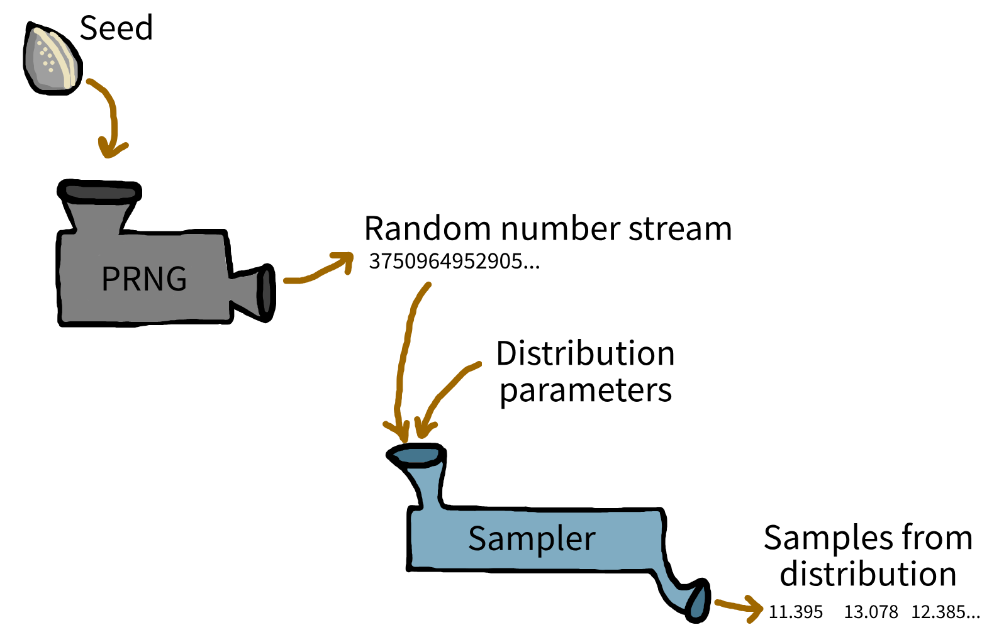

::: {.notes}

Computers can't generate "true" randomness. Instead, they use pseudorandom number generators (PRNGs).

These are algorithms that produce a sequence of numbers that appear random, but are actually determined by an initial starting point called a seed. If you don't set a seed, they will use something that changes rapidly, like the current system time.

For reproducible experiments, we want to set the seed, we we can recreate simulation results.

:::

<!----------------------------------------------------------------------------
------------------------------- Next slide -----------------------------------
----------------------------------------------------------------------------->

## Randomness: Python {auto-animate="true"}

`numpy`

```{.python}
rng = np.random.default_rng(seed=20)
rng.exponential(scale=17, size=3)
```

`sim-tools`

```{.python}
exp = Exponential(mean=6, random_seed=3)
samples = exp.sample(size=3)
```

::: {.fragment}

`sim-tools` can help with problem of shared random number generators.

:::

::: {.notes}

In Python, `numpy` is widely used for this. We create a generator object - here called `rng`. We then use this when sampling.

Another package from Tom Monks in our team is `sim-tools`, which uses `numpy` underneath the hood.

---

We tend to use `sim-tools` in our work as it allows us to avoid the problem of shared random number generators.

:::

<!----------------------------------------------------------------------------
------------------------------- Next slide -----------------------------------
----------------------------------------------------------------------------->

## Randomness: Python {auto-animate="true"}

`sim-tools` can help with problem of shared random number generators.

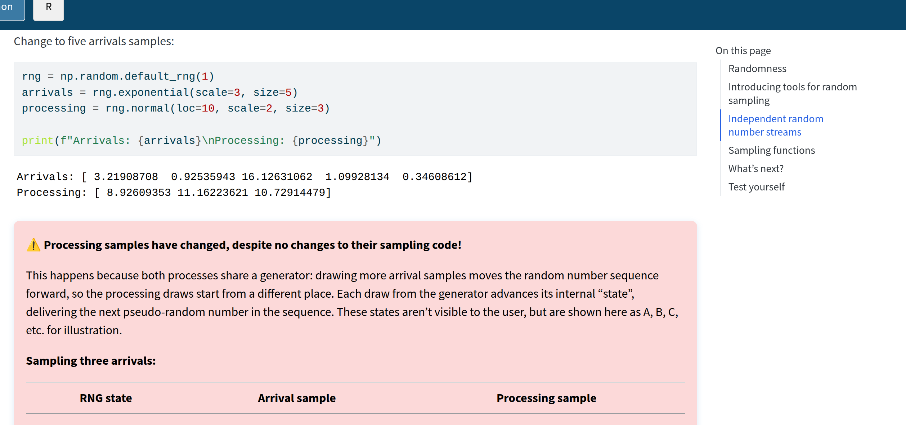

::: {.notes}

It's a little complex to explain, so I won't go over it now, but we walk through it in the book.

:::

<!----------------------------------------------------------------------------
------------------------------- Next slide -----------------------------------
----------------------------------------------------------------------------->

## Randomness: R

`stats`

```{.r}
library(stats)

set.seed(3L)
rexp(n = 3L, rate = 1L / 6L)
```

`simEd` (slower)

```{.r}
library(simEd)

set.seed(1L)
arrivals <- vexp(n = 3L, rate = 1L / 3L)
processing <- vnorm(n = 3L, mean = 10L, sd = 2L)
```

::: {.notes}

In R, the `stats` package is typically used for sampling from distributions.

There is also a package called `simEd` which again avoids the shared generator problem - but we haven't typically used it in our work, as we found it was slower than the `stats` package, and as the shared generator problem is not too big an issue either way, it's just good to be aware of if you are sampling.

:::

<!----------------------------------------------------------------------------
------------------------------- Next slide -----------------------------------
----------------------------------------------------------------------------->

## Building a DES model

We guide through creating incrementally...

::: {.fragment}

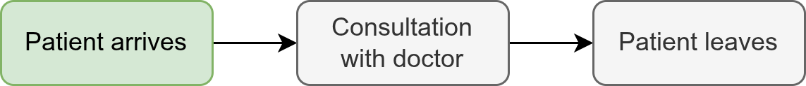

:::

::: {.fragment}

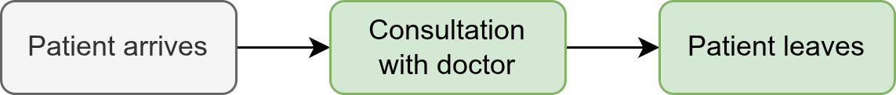

:::

::: {.fragment}

`simpy` (Python) and `simmer` (R)

:::

::: {.notes}

In the book, we walk through setting up a basic model incrementally, starting just with code that generates arrivals.

---

We then add on resource usage.

---

We use `simpy` (python) and `simmer` (R), which are the most popular DES packages in each language.

:::

<!----------------------------------------------------------------------------
------------------------------- Next slide -----------------------------------
----------------------------------------------------------------------------->

## Initialisation bias {auto-animate="true"}

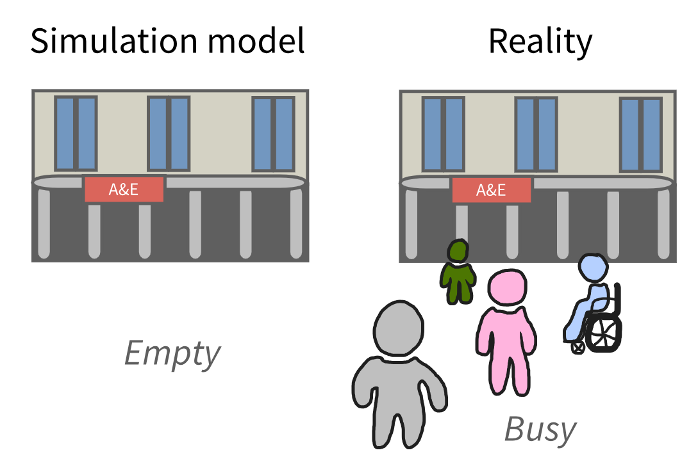{fig-align="center"}

::: {.notes}

When building the model, we need to deal with initialisation bias. This is when the model starts in an “empty” state that does not match how the real system normally operates.

:::

<!----------------------------------------------------------------------------
------------------------------- Next slide -----------------------------------
----------------------------------------------------------------------------->

## Initialisation bias {auto-animate="true"}

{fig-align="center"}

Two main strategies:

* Initial conditions: start with some entities/resources.
* Warm-up period: run model until it reaches a steady state.

::: {.notes}

There are two main strategies:

1. Initial conditions - start the model with some entities or resources already present - though this can be difficult, as it requires relevant data for determining an appropriate starting state, and therefore, we focus on-

2. Warm-up period - run the model for a while until it reaches a steady state, then begin collecting results from that point onwards.

Implementing a warm-up period requires quite different strategies for `simpy` v.s., `simmer`.

:::

<!----------------------------------------------------------------------------
------------------------------- Next slide -----------------------------------
----------------------------------------------------------------------------->

## Initialisation bias {auto-animate="true"}

Time series inspection approach.

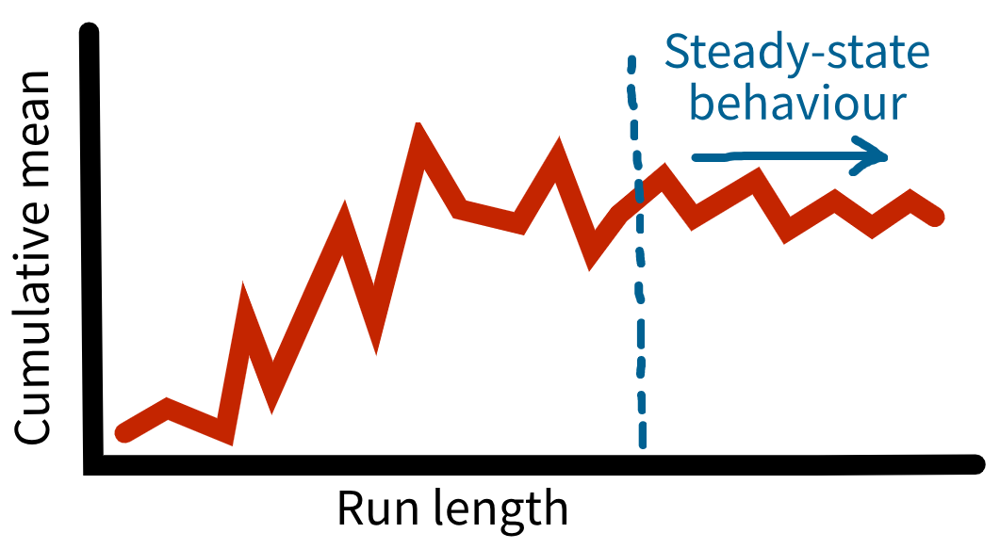{fig-align="center"}

::: {.notes}

We choose the length of the warm-up period using the time series inspection approach, looking at the cumulative mean for a given performance measure over time.

:::

<!----------------------------------------------------------------------------
------------------------------- Next slide -----------------------------------
----------------------------------------------------------------------------->

## Initialisation bias {auto-animate="true"}

Time series inspection approach.

{fig-align="center"}

How?

* Record performance measures at regular intervals.
* Run multiple replications and long run length.

::: {.notes}

This requires that we are able to record performance measures at regular intervals during the model run.

We need to run multiple replications and long run length too.

:::

<!----------------------------------------------------------------------------
------------------------------- Next slide -----------------------------------
----------------------------------------------------------------------------->

## Replications

{fig-align="center"}

::: {.notes}

We have to run the model multiple times, getting different results each time, and then we find the average of those.

:::

<!----------------------------------------------------------------------------
------------------------------- Next slide -----------------------------------
----------------------------------------------------------------------------->

## Replications

Confidence interval method - manual or automated.

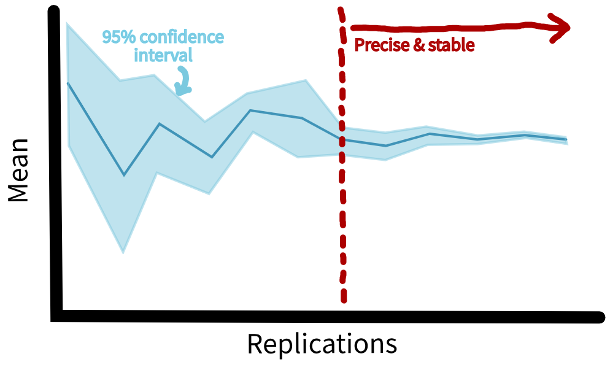{fig-align="center"}

::: {.notes}

In the book, to choose the number of replications, we use the confidence interval method, with manual or automated options. It involves running the simulation for an increasing number of times, and finding the point at which the confidence interval of the results is stable and narrow.

:::

<!----------------------------------------------------------------------------
------------------------------- Next slide -----------------------------------
----------------------------------------------------------------------------->

## Parallel processing

::: {.pale-gold}

Relevant guidelines:

* STARS Reproducibility Recommendations: Optimise model run time.

:::

::: {.notes}

Ideally, we want a model to run as fast as it can.

:::

<!----------------------------------------------------------------------------
------------------------------- Next slide -----------------------------------
----------------------------------------------------------------------------->

## Parallel processing

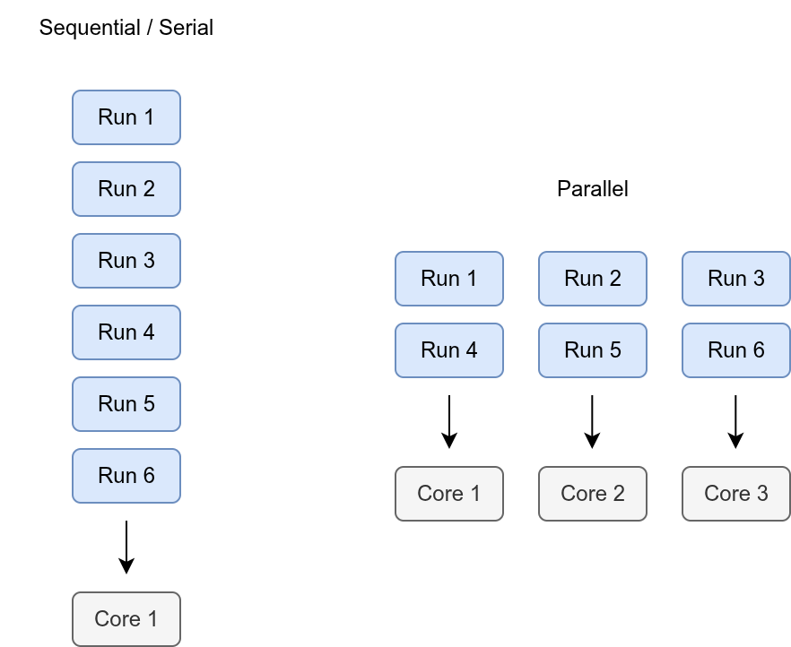{fig-align="center"}

::: {.notes}

Typically, the model will run replications sequentially, one after the other.

However, when we set up parallel processing, which we use the `joblib` and `future` packages to do, they can at the same time on different cores.

:::

<!----------------------------------------------------------------------------
------------------------------- Next slide -----------------------------------
----------------------------------------------------------------------------->

## Performance measures

* Total arrivals
* Mean wait time
* Mean time with resource
* Mean resource utilisation
* Mean queue length
* Mean time in system
* Mean number of patients in system
* Backlogged patient count
* Backlogged patient mean wait time

::: {.notes}

In the book, we show how to record nine different typical DES performance measures, but you'll find there are many more things you can output from the model too.

:::

<!----------------------------------------------------------------------------
------------------------------- Next slide -----------------------------------
----------------------------------------------------------------------------->

## Logging

::: {.pale-gold}

Relevant guidelines:

* NHS Levels of RAP (🥈): Logs are automatically recorded by the pipeline to ensure outputs are as expected.

:::

::: {.notes}

The NHS Levels of RAP encourages recording logs in your analysis.

:::

<!----------------------------------------------------------------------------
------------------------------- Next slide -----------------------------------
----------------------------------------------------------------------------->

## Logging (Python)

`print()` statements.

Logging class created with `logging` and `rich` packages.

Example use:

```{.python}
# Log consultation start time
self.logger.log(
    msg=f"Patient {patient.patient_id} starts consultation.",
    sim_time=self.env.now
)
```

Output to console or save to file.

::: {.notes}

In Python, this can be done simply using `print` statements.

We also explore how you can get more fancy, and use the `logging` and `rich` packages, and save your logs to a file as well.

:::

<!----------------------------------------------------------------------------
------------------------------- Next slide -----------------------------------
----------------------------------------------------------------------------->

## Logging (R)

Run `simmer` with `verbose = TRUE`:

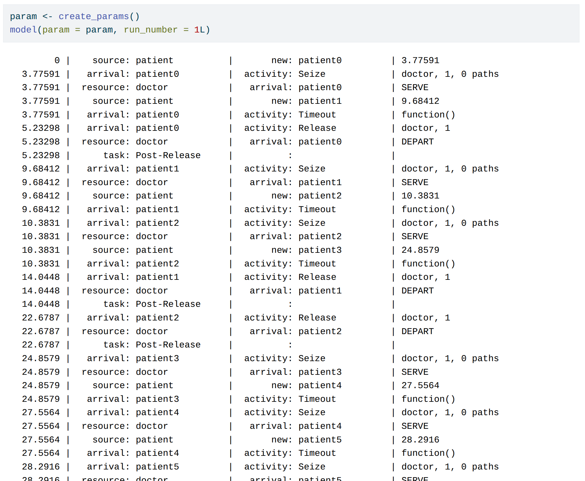

::: {.notes}

In R, `simmer` will provide `logs` if you set `verbose` to `TRUE`. These are great, if a little hard to read.

:::

<!----------------------------------------------------------------------------
------------------------------- Next slide -----------------------------------
----------------------------------------------------------------------------->

## Logging (R)

Custom logs using `simmer::log_()`:

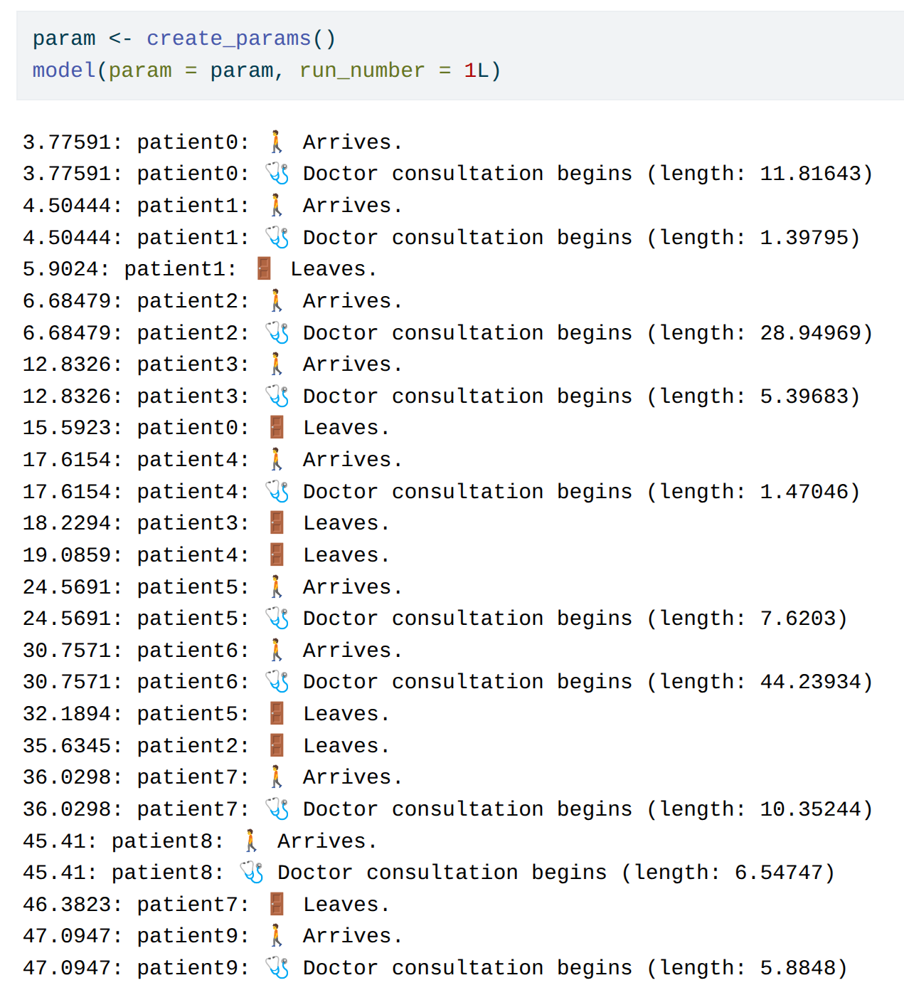

::: {.notes}

It is possible to create custom logs with the `log_()` function, although we do typically just use the basic ones, but this is a great option to explore too, to produce logs that are easier to read.

:::

<!----------------------------------------------------------------------------
------------------------------- Next slide -----------------------------------
----------------------------------------------------------------------------->

## Modular model structure

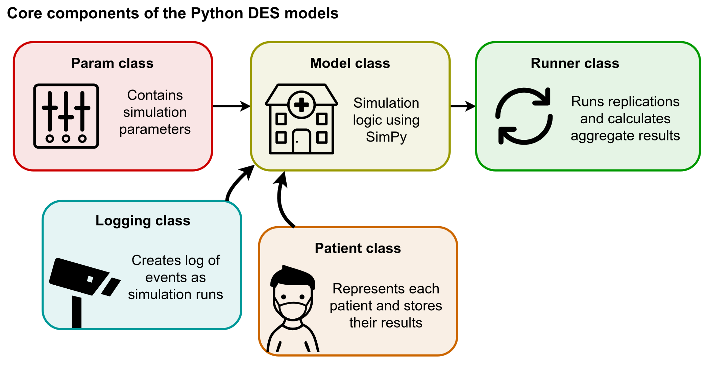{fig-align="center"}

::: {.notes}

As we build the model, we are using a modular structure. This is just a simplified view here, but to show that, in Python, we use different classes that are working together, that contain parameters, patient attributes, the model logic, as well as classes to run the model and log results.

:::

<!----------------------------------------------------------------------------
------------------------------- Next slide -----------------------------------
----------------------------------------------------------------------------->

## Modular model structure

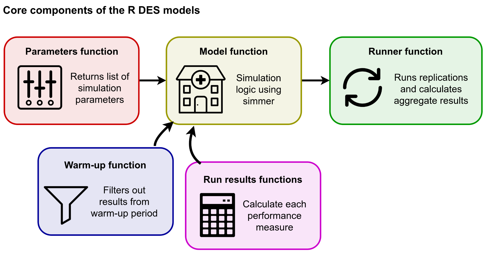

::: {.notes}

We do the same in the R model but with functions, to return parameters, provide model logic, run the model, filter out warm-up results, and calculate performance measures.

:::

<!----------------------------------------------------------------------------
------------------------------- Next slide -----------------------------------
----------------------------------------------------------------------------->

# Experimentation

<!----------------------------------------------------------------------------
------------------------------- Next slide -----------------------------------
----------------------------------------------------------------------------->

## Scenario and sensitivity analysis

::: {.pale-gold}

Relevant guidelines:

* STARS Reproducibility Recommendations (⭐): Provide code for all scenarios and sensitivity analyses.
* STARS Reproducibility Recommendations: Save outputs to a file.
* STARS Reproducibility Recommendations: Avoid excessive output files.
* STARS Reproducibility Recommendations: Address large file sizes.

:::

::: {.notes}

In our analyses, we want to think about how we are saving to output files, and sharing code.

:::

<!----------------------------------------------------------------------------
------------------------------- Next slide -----------------------------------
----------------------------------------------------------------------------->

## Scenario and sensitivity analysis

<br>

**Scenario analysis:** Set of pre-defined situations plausible and relevant to problem being studied. Purpose is to understand how system operates under different scenarios.

<br>

::: {.fragment}

**Sensitivity analysis:** Assess impact of parameter changes on outcomes. Purpose is to understand how uncertainty in inputs affects the model.

:::

::: {.notes}

For DES, we have scenario analysis, which involves running a set of pre-defined situations plausible and relevant to problem being studied. The purpose is to understand how system operates under different scenarios.

---

We also run sensitivity analyses, which assess how changes in parameter values impact on outcomes. This aims to understand how uncertainty in inputs affects the model, and how robust it is to uncertainty in inputs.

:::

<!----------------------------------------------------------------------------
------------------------------- Next slide -----------------------------------
----------------------------------------------------------------------------->

## Scenario and sensitivity analysis

Two important things to remember:

**1. Run scenarios programmatically.** For example:

```{.r}
results <- list()
# Loop through doctor counts 3-6, running the simulation
for (i in 3L:6L) {
  param <- create_params(number_of_doctors = i)
  result <- runner(param = param)[["run_results"]]
  # Add scenario information to the results, then save to list
  result["number_of_doctors"] <- i
  results[[length(results) + 1L]] <- result
}

# Combine results into a single dataframe
scenario_results <- do.call(rbind, results)

# Show as interactive table
kable(scenario_results) |> scroll_box(height = "400px")
```

::: {.notes}

Two things to remember. One is to run scenarios programmatically.

For example here, we run through different scenarios of different numbers of doctors in a loop, getting results from each scenario and saving those.

:::

<!----------------------------------------------------------------------------
------------------------------- Next slide -----------------------------------
----------------------------------------------------------------------------->

## Scenario and sensitivity analysis

Two important things to remember:

**1. Run scenarios programmatically.**

**2. Share your scenario code.**

::: {.notes}

And also, to make sure to share that code. As it is very often not shared, at least in models you find published in journals.

:::

<!----------------------------------------------------------------------------
------------------------------- Next slide -----------------------------------
----------------------------------------------------------------------------->

## Tables and figures

::: {.pale-gold}

Relevant guidelines:

* STARS Reproducibility Recommendations (⭐): Include code to generate the tables, figures, and other reported results.
* STARS Reproducibility Recommendations: Save outputs to a file.

:::

**Key point: share code!**

::: {.notes}

Again, for tables and figures, we want to write code that makes those, and make sure to save and share that code.

:::

<!----------------------------------------------------------------------------
------------------------------- Next slide -----------------------------------
----------------------------------------------------------------------------->

## Full run

{fig-align="center"}

::: {.pale-gold}

Relevant guidelines:

* STARS Reproducibility Recommendations (⭐): Ensure model parameters are correct.
* NHS Levels of RAP (🥈): Outputs are produced by code with minimal manual intervention.

:::

::: {.notes}

You'll recall that a RAP involves running our analysis from end-to-end with minimal intervention. There's a few different ways to do this...

:::

<!----------------------------------------------------------------------------
------------------------------- Next slide -----------------------------------
----------------------------------------------------------------------------->

## Full run {auto-animate="true"}

**main.py/main.R**.

::: {.desc}

Suitable if everything in `.py`/`.R` files (i.e. no `.ipynb`/`.Rmd`). Write a main function that imports all necessary code and runs pipeline.

:::

::: {.fragment}

**Bash**

::: {.desc}

Can run a mixture of file types (e.g., `.py`, `.R`, `.ipynb`, `.Rmd`).
Write shell script that executes files. May combine with `main.py`/`main.R`.

:::

:::

::: {.fragment}

**Makefile**

::: {.desc}

Track which outputs depend on which inputs, and only re-run steps when the inputs have changed

:::

:::

::: {.fragment}

**Snakemake**

::: {.desc}

Tool that builds on Makefile, supporting very complex pipelines and lots of tools and languages.

:::

:::

::: {.notes}

main...

---

bash...

---

makefile...

---

snakemake...

:::

<!----------------------------------------------------------------------------
------------------------------- Next slide -----------------------------------
----------------------------------------------------------------------------->

## Full run {auto-animate="true"}

:::: {.faded}

**main.py/main.R**.

::: {.desc}

Suitable if everything in `.py`/`.R` files (i.e. no `.ipynb`/`.Rmd`). Write a main function that imports all necessary code and runs pipeline.

:::

::::

**Bash**

::: {.desc}

Can run a mixture of file types (e.g., `.py`, `.R`, `.ipynb`, `.Rmd`).
Write shell script that executes files. May combine with `main.py`/`main.R`.

:::

:::: {.faded}

**Makefile**

::: {.desc}

Track which outputs depend on which inputs, and only re-run steps when the inputs have changed

:::

::::

:::: {.faded}

**Snakemake**

::: {.desc}

Tool that builds on Makefile, supporting very complex pipelines and lots of tools and languages.

:::

::::

::: {.notes}

In the book, we focus on bash, as it can run different file types, so is well suited to our project structure, where we might have analysis in python files, r files, notebooks or rmarkdown files.

:::

<!----------------------------------------------------------------------------
------------------------------- Next slide -----------------------------------
----------------------------------------------------------------------------->

## Full run

```{.bash}
#!/bin/bash

# Ensure the script exits on error
set -e

# Find and render all .Rmd files in the specified directory
for file in "rmarkdown"/*.Rmd; do
    echo "Rendering: $file"
    Rscript -e "rmarkdown::render('$file')"
done

echo "Rendering complete!"
```

::: {.notes}

This is an example of bash script, which we would run from the terminal or from Git Bash on windows.

Here, it is running all the R markdown files in a directory.

:::

<!----------------------------------------------------------------------------
------------------------------- Next slide -----------------------------------
----------------------------------------------------------------------------->

## Full run

```{.bash}
#!/usr/bin/env bash

# Get the conda environment's jupyter path
CONDA_JUPYTER=$(dirname "$(which python)")/jupyter

run_notebook() {
    local nb="$1"
    echo "🏃 Running notebook: $nb"
    if "${CONDA_JUPYTER}" nbconvert --to notebook --inplace --execute \
        --ClearMetadataPreprocessor.enabled=True \
        --ClearMetadataPreprocessor.clear_notebook_metadata=True \
        "$nb"
    then
        echo "✅ Successfully processed: $nb"
    else
        echo "❌ Error processing: $nb"
    fi
    echo "-------------------------"
}

if [[ -n "$1" ]]; then
    run_notebook "$1"
else
    for nb in notebooks/*.ipynb; do
        run_notebook "$nb"
    done
fi
```

::: {.notes}

This is a Python example running Jupyter notebooks - it could look simpler than this, we've just incorporated some functionality to remove some of the metadata that gets stored with the notebook.

:::

<!----------------------------------------------------------------------------
------------------------------- Next slide -----------------------------------
----------------------------------------------------------------------------->

# Verification and validation

<!----------------------------------------------------------------------------
------------------------------- Next slide -----------------------------------
----------------------------------------------------------------------------->

## Verification and validation

::: {style="font-size: 80%"}

**Verification:** The process of checking that the simulation model correctly implements the intended conceptual model.

It involves checking that the model’s logic, structure and parameters are implemented as planned and free from coding errors.

:::

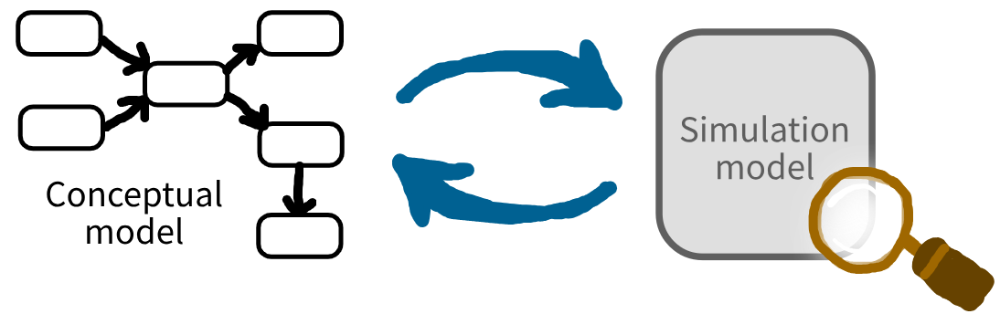{fig-align="center"}


::: {.notes}

Verification...

:::

<!----------------------------------------------------------------------------
------------------------------- Next slide -----------------------------------
----------------------------------------------------------------------------->

## Verification and validation

::: {style="font-size: 80%"}

**Validation:** The process of checking whether the simulation model is a sufficiently accurate representation of your real system.

It involves comparing the model’s inputs, behaviour and results to the real system

:::

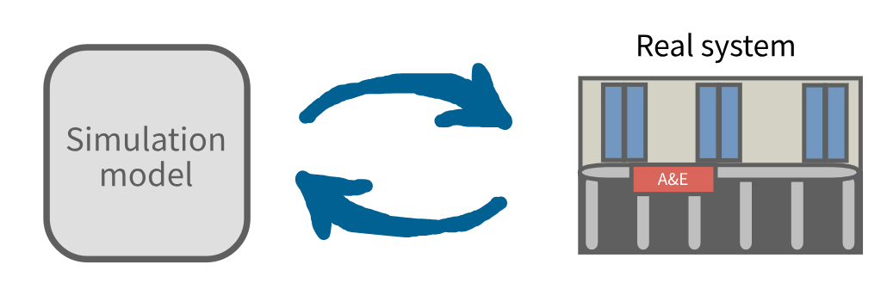{fig-align="center"}

::: {.notes}

Validation...

:::

<!----------------------------------------------------------------------------
------------------------------- Next slide -----------------------------------
----------------------------------------------------------------------------->

## Verification and validation

```{.md}
# Verification and validation checklist

This checklist is from: Heather, A., Monks, T., Mustafee, N., Harper, A., Alidoost, F., Challen, R., & Slater, T. (2025). DES RAP Book: Reproducible Discrete-Event Simulation in Python and R. https://github.com/pythonhealthdatascience/des_rap_book. https://doi.org/10.5281/zenodo.17094155.

## Verification

Desk checking

* [ ] Systematically check code.
* [ ] Keep documentation complete and up-to-date.
* [ ] Maintain an environment with all required packages.
* [ ] Lint code.
* [ ] Get code review.

Debugging

* [ ] Write tests - they'll help for spotting bugs.
* [ ] Use GitHub issues to record bugs as they arise, so they aren't forgotten and are recorded for future reference.

Execution tracing

* [ ] Add logging or tracing output around key decisions. Run the model for a short, controlled period and manually check the trace against your conceptual model.

Assertion checking

* [ ] Add checks in the model which cause errors if something doesn't look right.
* [ ] Write tests which check that assertions hold true.

Special input testing

* [ ] If there are input variables with explicit limits, design boundary value tests to check the behaviour at, just inside, and just outside each boundary.
* [ ] Write stress tests which simulate worst-case load and ensure model is robust under heavy demand.
* [ ] Write tests with little or no activity/waits/service.

Bottom-up testing

* [ ] Write unit tests for each individual component of the model.
* [ ] Once individual parts work correctly, combine them and test how they interact - this can be via integration testing or functional testing.

Regression testing

* [ ] Write tests early.
* [ ] Run tests regularly (locally or automatically via. GitHub actions).

Mathematical proof of correctness

* [ ] For parts of the model where theoretical results exist (like an M/M/s queue), compare simulation outputs with results from mathematical formulas.

## Validation

Conceptual model validation

* [ ] Document and justify all modeling assumptions.
* [ ] Review the conceptual model with people familiar with the real system to assess completeness and accuracy.

Input data validation

* [ ] Check the datasets used - screen for outliers, determine if they are correct, and if the reason for them occurring should be incorporated into the simulation.
* [ ] Ensure you have performed appropriate input modelling steps when choosing your distributions.

Graphical comparison

* [ ] Create time-series plots and distributions of key results (e.g., daily patient arrivals, resource utilisation, waiting times) for both the model and the actual system, and compare the graphs to assess whether patterns and trends are similar.

Statistical comparison

* [ ] Collect real system data on key performance measures (e.g., wait times, lengths of stay, throughput) and compare with model outputs statistically using appropriate tests.

Turing test

* [ ] Collect matching sets of model output and real system, remove identifying labels, and present them to a panel of experts. Record whether experts can distinguish simulation outputs from real data. Use their feedback on distinguishing features to further improve the simulation.

Predictive validation

* [ ] Use historical arrival data, staffing schedules, treatment times, or other inputs from a specific time period to drive your simulation. Compare the simulation's predictions for that period (e.g., waiting times, bed occupancy) against the real outcomes for the same period.
* [ ] Consider varying the periods you validate on—year-by-year, season-by-season, or even for particular policy changes or events—to detect strengths or weaknesses in the model across different scenarios.
* [ ] Use graphical comparisons (e.g., time series plots) or statistical measures (e.g., goodness-of-fit, mean errors, confidence intervals) to assess how closely the model matches reality - see below.

Animation visualisation

* [ ] Create an animation to help with validation (as well as communication and reuse).

Comparison testing

* [ ] If you have multiple models of the same system, compare them!

Face validation

* [ ] Present key simulation outputs and model behaviour to people such as: project team members; intended users of the model (e.g., healthcare analysts, managers); people familiar with the real system (e.g., clinicians, frontline staff, patient representatives). Ask for their subjective feedback on whether the model and results "look right". Discuss specific areas, such as whether performance measures (e.g., patient flow, wait times) match expectations under similar conditions.

Experimentation validation

* [ ] Use a warm-up period.
* [ ] Use statistical methods to determine sufficient run length and number of replications.
* [ ] Perform sensitivity analysis to test how changes in input parameters affect outputs.

Cross validation

* [ ] Search for similar simulation studies and compare the key assumptions, methods and results. Discuss discrepancies and explain reasons for different findings or approaches. Use insights from other studies to improve or validate your own model.
```

::: {.notes}

In the book, we provide an overview of the main types of verification and validation that people do for DES models.

But we also make them more actionable, providing a checklist of things you might do for each.

:::

<!----------------------------------------------------------------------------
------------------------------- Next slide -----------------------------------
----------------------------------------------------------------------------->

## Tests

::: {.pale-gold}

Relevant guidelines:

* NHS Levels of RAP (🥈): Pipeline includes a testing framework (unit tests, back tests).

:::

::: {.notes}

Tests are often an important component of verification and validation, and important for RAPs as well.

:::

<!----------------------------------------------------------------------------
------------------------------- Next slide -----------------------------------
----------------------------------------------------------------------------->

## Tests

Guidance in DES RAP Book - and in our other resource:

[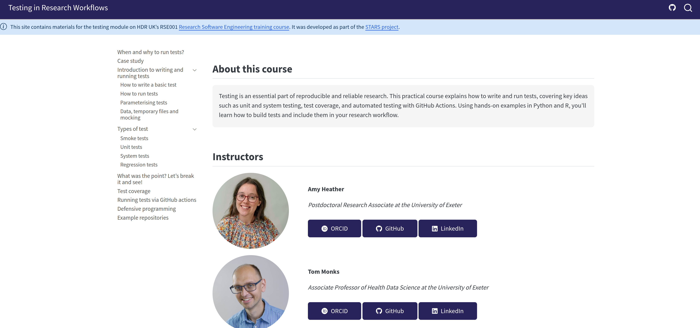](https://pythonhealthdatascience.github.io/stars-testing-intro/)

<https://pythonhealthdatascience.github.io/stars-testing-intro/>

::: {.notes}

In the book, we guide you through how to write tests with `pytest` in Python and `testthat` in R.

I also wanted to mention another resource we have, which is more general, and focuses more broadly on how to write Python and R tests for research projects.

:::

<!----------------------------------------------------------------------------
------------------------------- Next slide -----------------------------------
----------------------------------------------------------------------------->

## Tests

Stuck for ideas? See example repositories

* Python M/M/s model - <https://github.com/pythonhealthdatascience/pydesrap_mms>
* R M/M/s model - <https://github.com/pythonhealthdatascience/rdesrap_mms>
* Python stroke model - <https://github.com/pythonhealthdatascience/pydesrap_stroke>
* R stroke model - <https://github.com/pythonhealthdatascience/rdesrap_stroke>

::: {.notes}

One of the hardest parts I found when getting started with writing DES models was knowing what to test. So when writing tests, this is a great opportunity to look at those four example models I mentioned, and see the sorts of things we tested in there, and how we did it.

:::

<!----------------------------------------------------------------------------
------------------------------- Next slide -----------------------------------
----------------------------------------------------------------------------->

## Quality assurance

::: {style="font-size: 80%"}

Quality assurance (QA) is the formal, systematic process of ensuring your analysis meets appropriate standards of quality and is suitable for its intended use. It means **planning how you will check the work, carrying out those checks, and keeping clear evidence of what you did**.

:::

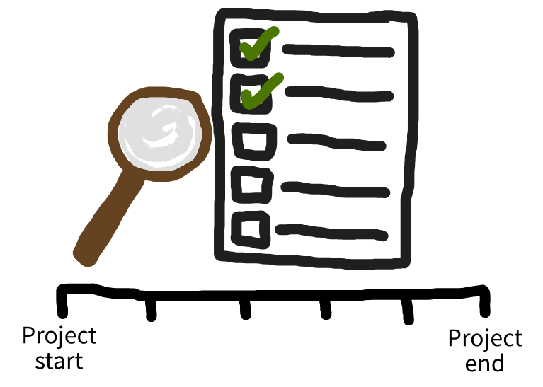{fig-align="center"}

::: {.notes}

Related to all this is the concept of quality assurance. There's lots of standard government guidance and things around this, which we touch on in the book, but at it's core, QA is essentially just a formal, systematic process you take to check the quality of you work.

It means planning how you will check your work, carrying out those checks, and keeping clear evidence of what you did, ideally from the start of the project.

:::

<!----------------------------------------------------------------------------
------------------------------- Next slide -----------------------------------
----------------------------------------------------------------------------->

## Quality assurance

::: {style="font-size: 80%"}

Example: QA in the [New Hospital Programme](https://connect.strategyunitwm.nhs.uk/nhp/project_information/) (The Strategy Unit).

:::

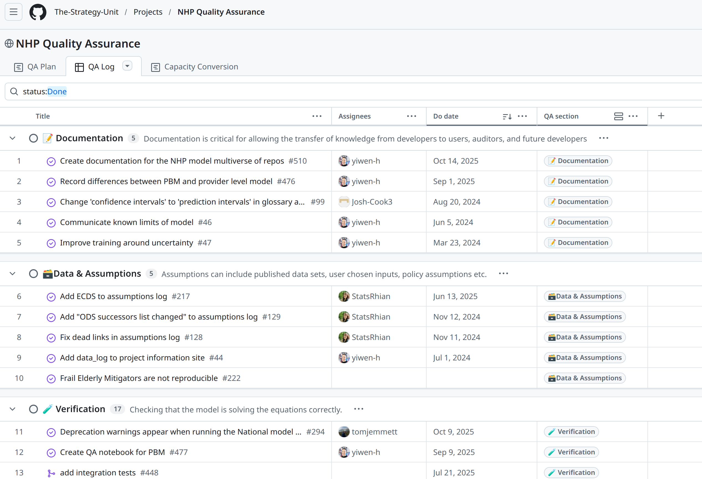{fig-align="center"}

::: {.notes}

A project I want to shout-out for QA is the New Hospital Programme. They do a bunch of things, but one I really like is the use of GitHub projects and GitHub issues to track there QA for the model.

:::

<!----------------------------------------------------------------------------
------------------------------- Next slide -----------------------------------
----------------------------------------------------------------------------->

# Style and documentation

<!----------------------------------------------------------------------------
------------------------------- Next slide -----------------------------------
----------------------------------------------------------------------------->

## Linting

::: {.pale-gold}

Relevant guidelines:

* NHS Levels of RAP (🥈): Code adheres to agreed coding standards (e.g PEP8, style guide for Pyspark).

:::

::: {.notes}

Maintaining code standards is a requirement in the NHS Levels of RAP.

:::

<!----------------------------------------------------------------------------
------------------------------- Next slide -----------------------------------
----------------------------------------------------------------------------->

## Linting: style guides {auto-animate="true"}

Set of rules and conventions for writing code.

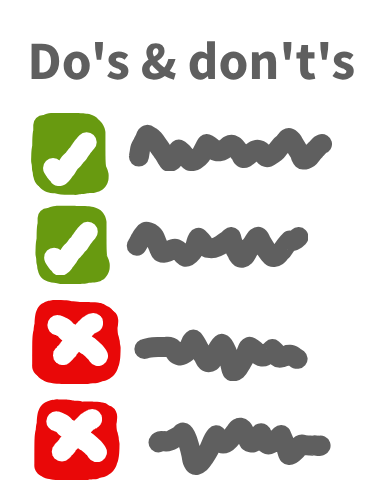{fig-align="center"}

::: {.notes}

Style guides are a set of rules and conventions for writing code.

:::

<!----------------------------------------------------------------------------
------------------------------- Next slide -----------------------------------
----------------------------------------------------------------------------->

## Linting: style guides {auto-animate="true"}

Set of rules and conventions for writing code.

:::: {.columns}

::: {.column width="60%"}

Popular examples in Python:

* [PEP-8](https://peps.python.org/pep-0008/)
* [Google Python style guide](https://google.github.io/styleguide/pyguide.html)

Popular examples in R:

* [Tidyverse style guide](https://style.tidyverse.org/)
* [Google R style guide](https://google.github.io/styleguide/Rguide.html)

:::

::: {.column width="40%"}


:::

::::

::: {.notes}

...

:::

<!----------------------------------------------------------------------------
------------------------------- Next slide -----------------------------------
----------------------------------------------------------------------------->

## Linting: linters {auto-animate="true"}

Analyse code for possible errors and style issues.

{fig-align="center"}

::: {.notes}

...

:::

<!----------------------------------------------------------------------------
------------------------------- Next slide -----------------------------------
----------------------------------------------------------------------------->

## Linting: linters {auto-animate="true"}

Analyse code for possible errors and style issues.

:::: {.columns}

::: {.column width="60%"}

Popular examples in Python:

* [pylint](https://pypi.org/project/pylint/)
* [flake8](https://pypi.org/project/flake8/)
* [ruff](https://pypi.org/project/ruff/)

Popular in R:

* [lintr](https://lintr.r-lib.org/)

:::

::: {.column width="40%"}


:::

::::

::: {.notes}

...

:::

<!----------------------------------------------------------------------------
------------------------------- Next slide -----------------------------------
----------------------------------------------------------------------------->

## Linting: linters

<br>

Python: Run from the command line

```{.python}
pylint code.py
```

<br>

R: Run from the R console

```{.r}
lintr::lint("code.R")
```

::: {.notes}

...

:::

<!----------------------------------------------------------------------------
------------------------------- Next slide -----------------------------------
----------------------------------------------------------------------------->

## Linting: code formatters {auto-animate="true"}

Automatically format your code.

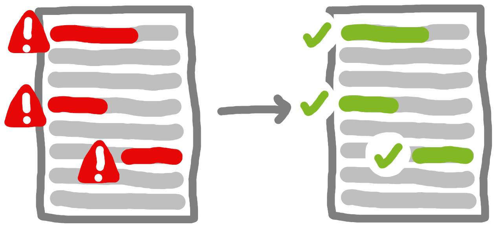{fig-align="center"}

::: {.notes}

...

:::

<!----------------------------------------------------------------------------
------------------------------- Next slide -----------------------------------
----------------------------------------------------------------------------->

## Linting: code formatters {auto-animate="true"}

Automatically format your code.

:::: {.columns}

::: {.column width='60%'}

Popular examples in Python:

* [ruff](https://github.com/astral-sh/ruff)
* [black](https://github.com/psf/black)

Popular examples in R:

* [styler](https://styler.r-lib.org/)
* [formatR](https://yihui.org/formatr/)
* [air](https://posit-dev.github.io/air/)

:::

::: {.column width='40%'}


:::

::::

::: {.notes}

...

:::

<!----------------------------------------------------------------------------
------------------------------- Next slide -----------------------------------
----------------------------------------------------------------------------->

## Linting: Quarto

[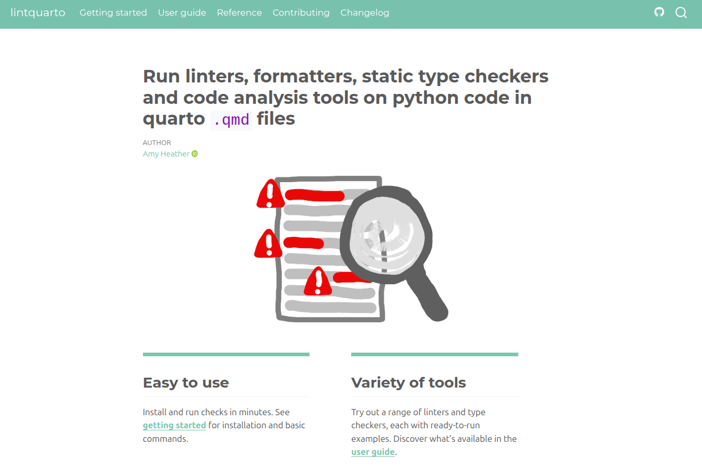](https://lintquarto.github.io/lintquarto/)

::: {.notes}

One package I want to shout out is my own, it's a Python package called `lintquarto`, and it enables you to run linters, formatters, static type checkers and code analysis tools on Python code in Quarto files, if you are using Quarto.

:::

<!----------------------------------------------------------------------------
------------------------------- Next slide -----------------------------------
----------------------------------------------------------------------------->

## Docstrings

::: {.pale-gold}

Relevant guidelines:

* STARS Reproducibility Recommendations: Comment sufficiently.
* NHS Levels of RAP (🥈): Code is well-documented including user guidance, explanation of code structure & methodology and docstrings for functions.

:::

::: {.notes}

Next, comments and docstrings, both important things.

:::

<!----------------------------------------------------------------------------
------------------------------- Next slide -----------------------------------
----------------------------------------------------------------------------->

## Docstrings

**In-line comments** clarify individual lines/sections of code when the logic is otherwise unclear.

**Docstrings** explain the overall purpose of a code object.

::: {.fragment}

Why write docstrings?

* Clarity and consistency.
* Maintainability and reproducibility.
* Documentation websites.
* Interactive help systems.

:::


::: {.notes}

**In-line comments** clarify individual lines/sections of code when the logic is otherwise unclear.

**Docstrings** explain the overall purpose of a code object.

---

Docstrings make code easier to understand and provide a uniform way to document your work, which is especially valuable when collaborating.

They help future users (including yourself) see the purpose and usage of code, making ongoing maintenance and reuse simpler and less error-prone

If you structure your work as a package and build a documentation website, the docstrings are automatically used to generate reference guides and manuals.

When comments follow a docstring format, you can view them in help panels too.

:::

<!----------------------------------------------------------------------------
------------------------------- Next slide -----------------------------------
----------------------------------------------------------------------------->

## Docstrings: Python

Popular docstring styles: [numpydoc](https://numpydoc.readthedocs.io/en/latest/format.html) and [google style](https://google.github.io/styleguide/pyguide.html#38-comments-and-docstrings).

NumPy style:

```{.python}
def estimate_wait_time(queue_length, avg_service_time):
    """
    Estimate the total wait time for all customers in the queue.

    Parameters
    ----------
    queue_length : int or float
        Number of customers currently in the queue.
    avg_service_time : int or float
        Average time taken to serve one customer.

    Returns
    -------
    float
        Estimated total wait time.
    """
    return queue_length * avg_service_time
```

::: {.notes}

In Python, docstrings are between triple quotes.

There are popular guides on how to style them like numpydoc and google style.

This is an example of a numpy style docstring for a function.

You'll find they vary a bit between functions, classes, modules and tests.

:::

<!----------------------------------------------------------------------------
------------------------------- Next slide -----------------------------------
----------------------------------------------------------------------------->

## Docstrings: R

R docstrings always use [roxygen2](https://roxygen2.r-lib.org/) style.

```{.r}
#' Estimate the total wait time for all customers in the queue.
#'
#' @param queue_length numeric Number of customers currently in the queue.
#' @param avg_service_time numeric Average time taken to serve one customer.
#'
#' @return numeric Estimated total wait time.
#' @export

estimate_wait_time <- function(queue_length, avg_service_time) {
  queue_length * avg_service_time
}
```

::: {.notes}

In R, docstrings always use the `roxygen2` style.

It involves tags like `param` and `return`, with an example here for an R function.

:::

<!----------------------------------------------------------------------------
------------------------------- Next slide -----------------------------------
----------------------------------------------------------------------------->

## GitHub actions

::: {.pale-gold}

Relevant guidelines:

* NHS Levels of RAP (🥇): Repository automatically runs tests etc. via CI/CD or a different integration/deployment tool e.g. GitHub Actions.

:::

::: {.notes}

GitHub actions. Using actions or similar tools are a requirement in the gold tier of the NHS Levels of RAP.

:::

<!----------------------------------------------------------------------------
------------------------------- Next slide -----------------------------------
----------------------------------------------------------------------------->

## GitHub actions

```{.yaml}
name: Example action # <1>
run-name: Example action # <1>

on: # <2>
  push: # <2>
    branches: [main] # <2>

jobs: # <3>
  checkout-echo: # <3>
    runs-on: ubuntu-latest # <4>
    permissions: # <5>
      contents: read # <5>
    steps: # <6>
      - name: Checkout # <6>
        uses: actions/checkout@v4 # <6>
      - name: Run basic echo command # <6>
        run: echo "Hello from GitHub Actions!" # <6>
```

1. Name of workflow.
2. Events that trigger workflow e.g., `push`, `pull_request`, `workflow_dispatch`.
3. One or multiple jobs, can run sequentially or in parallel. 
4. Operating system e.g., `ubuntu-latest`, `windows-latest`, `macos-latest`
5. Access granted to workflow.
6. Ordered tasks in a job.

::: {.notes}

GitHub actions are defined in yaml workflow files. This is the basic structure of those files.

(Hover over and explain).

:::

<!----------------------------------------------------------------------------
------------------------------- Next slide -----------------------------------
----------------------------------------------------------------------------->

## GitHub actions

Use GitHub actions for:

* Tests
* Test coverage
* Linting
* Documentation

And more!

::: {.notes}

Some of the key things we use GitHub actions for are to run tests, calculate test coverage, run linters, and build documentation.

:::

<!----------------------------------------------------------------------------
------------------------------- Next slide -----------------------------------
----------------------------------------------------------------------------->

## GitHub actions: tests (Python)

```{.yaml}
name: tests

on:
  push:
    branches: [main]
  workflow_dispatch:

jobs:
  tests:
    runs-on: ubuntu-latest
    steps:
      - name: Check out repository
        uses: actions/checkout@v4

      - name: Install python and dependencies
        uses: actions/setup-python@v4
        with:
          python-version: '3.13'
          cache: 'pip'

      - name: Install requirements
        run: pip install -r requirements.txt

      - name: Run tests
        run: pytest
```

::: {.notes}

This is an example of a Python action which runs tests.

This is great, as it means when you push changes to GitHub, your tests run, and if something fails, you'll quickly notice and be able to change it, rather than making loads of changes, and not noticing until later down the line that something earlier broken everything.

:::

<!----------------------------------------------------------------------------
------------------------------- Next slide -----------------------------------
----------------------------------------------------------------------------->

## GitHub actions: tests (R)

If structured as a package:

```{.r}
usethis::use_github_action("check-standard")
```

Example:

```{.r}
name: R-CMD-check.yaml

on:
  push:
    branches: [main]
  workflow_dispatch:

permissions: read-all

jobs:
  R-CMD-check:
    runs-on: ubuntu-latest
    env:
      GITHUB_PAT: ${{ secrets.GITHUB_TOKEN }}
      R_KEEP_PKG_SOURCE: yes
    steps:
      - uses: actions/checkout@v4

      - uses: r-lib/actions/setup-pandoc@v2

      - uses: r-lib/actions/setup-r@v2
        with:
          r-version: 'release'
          use-public-rspm: true

      - uses: r-lib/actions/setup-r-dependencies@v2
        with:
          extra-packages: any::rcmdcheck
          needs: check

      - uses: r-lib/actions/check-r-package@v2
```

::: {.notes}

In R, the `usethis` package is really handy. If you structure you work as a package, you can just call `use_github_action` and it will generate the workflow file for you.

Here we have an example of a workflow file, again, running tests.

:::

<!----------------------------------------------------------------------------
------------------------------- Next slide -----------------------------------
----------------------------------------------------------------------------->

## Documentation

::: {.pale-gold}

Relevant guidelines:

* STARS Reproducibility Recommendations: Include run instructions.
* STARS Reproducibility Recommendations: State run times and machine specifications.
* NHS Levels of RAP (🥉): Repository includes a README.md file (or equivalent) that clearly details steps a user must follow to reproduce the code (use NHS Open Source Policy section on Readmes as a guide).
* NHS Levels of RAP (🥈): Code is well-documented including user guidance, explanation of code structure & methodology and docstrings for functions.

:::

::: {.notes}

Documentation is important for making work clear and understandable, and is mentioned alot in the frameworks.

:::

<!----------------------------------------------------------------------------
------------------------------- Next slide -----------------------------------
----------------------------------------------------------------------------->

## Documentation: `README.md`

::: {style="font-size: 50%"}

* ✔️ &nbsp;&nbsp; **Title**

* ✔️ &nbsp;&nbsp; **Summary** - describe project purpose and context.

* ✔️ &nbsp;&nbsp; **Authors** - named contributors, their ORCIDs, and contact details.

* ✔️ &nbsp;&nbsp; **Installation** - steps for setting up the environment.

* ✔️ &nbsp;&nbsp; **How to run the model** - basic instructions for executing the simulation.

* ✔️ &nbsp;&nbsp; **Reproduction instructions** - specific instructions on how to generate results from your report/publication.

* ✔️ &nbsp;&nbsp; **Inputs** - description of the input data.

* ✔️ &nbsp;&nbsp; **Project structure** - brief guide to main files and folders.

* ✔️ &nbsp;&nbsp; **Run time and machine specifications** - typical simulation duration (with computer requirements where relevant).

* ✔️ &nbsp;&nbsp; **Citation** - instructions for citing the project/repository.

* ✔️ &nbsp;&nbsp; **Licence** - state the license used and point to the `LICENSE` file.

* ✔️ &nbsp;&nbsp; **Funding and affiliations** - relevant sources of funding, support and affiliation.

* ✔️ &nbsp;&nbsp; **Acknowledgements** - credit external code or resources used, inspiration from other projects, and any assistance from individuals, large language models (e.g., ChatGPT, Perplexity) or tools that contributed to the work.

:::

::: {.notes}

If you've used GitHub, you'll be familiar with README files. These are like the entry-point to a repository, so should contain things like a description of the work, the authors, how to install and run the model, the typical run time for the simulation, any funding, affiliation, acknowledgements.

:::

<!----------------------------------------------------------------------------
------------------------------- Next slide -----------------------------------
----------------------------------------------------------------------------->

## Documentation: `README.md`

::: {style="font-size: 50%"}

| Badge | Markdown |
| - | - |
| [](https://github.com/pythonhealthdatascience/des_rap_book/blob/main/LICENSE) | `[](https://github.com/pythonhealthdatascience/des_rap_book/`<br>`blob/main/LICENSE)` |
| [](https://doi.org/10.5281/zenodo.17094155) | `[](https://doi.org/10.5281/zenodo.17094155)` |
| [](https://orcid.org/0000-0002-6596-3479) | `[](https://orcid.org/0000-0002-6596-3479)` |
|  | `` |
| [](https://github.com/pythonhealthdatascience/pydesrap_stroke/actions/workflows/lint.yaml) | `[](https://github.com/pythonhealthdatascience/pydesrap_stroke/`<br>`actions/workflows/lint.yaml)` |
: {tbl-colwidths="[30,70]"}

:::

::: {.notes}

You'll often see badges used to convey information. Some examples here... licence, DOI, ORCID, R version, status of a GitHub action.

:::

<!----------------------------------------------------------------------------
------------------------------- Next slide -----------------------------------
----------------------------------------------------------------------------->

## Documentation: `README.md`

All Contributors - <https://allcontributors.org/>

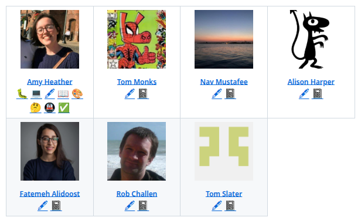{fig-align="center"}

::: {.notes}

In my projects, I always like to make use of all-contributors. You can read more about them at their website, but they are a great tool for recording who has contributed to the code.

As not everyone is making GitHub commits and pushing to GitHub, but there might be people reviewing code, providing ideas or troubleshooting, and we can acknowledge them.

All-contributors will produce a table in your README - this is an example of the table from the README for the DES RAP Book.

:::

<!----------------------------------------------------------------------------
------------------------------- Next slide -----------------------------------
----------------------------------------------------------------------------->

## Documentation: `CONTRIBUTING.md`

More technical information on working with the repository - for people who might join you in working on the code, using the code, and for yourself in the future.

Example of things to cover:

::: {style="font-size: 50%"}

* ✔️ &nbsp;&nbsp; **Tests** - how to run tests.

* ✔️ &nbsp;&nbsp; **Code style** - what style guide(s) are followed.

* ✔️ &nbsp;&nbsp; **Linting** - how and which linters to run.

* ✔️ &nbsp;&nbsp; **Releases** - if keeping a changelog and making releases,  
  instructions on how to do that, what to update for a new release, etc.

* ✔️ &nbsp;&nbsp; **Contributing** - if people come across the repository and wish to contribute or make suggestions, explain how (e.g., GitHub issue, fork, email, etc.).

:::

::: {.notes}

CONTRIBUTING files are typical of packages, but can be a good place to record more technical information about how to run the model and so on.

Things like testing, linting, building documentation, and so on.

To avoid README getting so cluttered!

And great for teams all working on the same project, or for future reuse or contributions to your work.

:::

<!----------------------------------------------------------------------------
------------------------------- Next slide -----------------------------------
----------------------------------------------------------------------------->

## Documentation: Website

[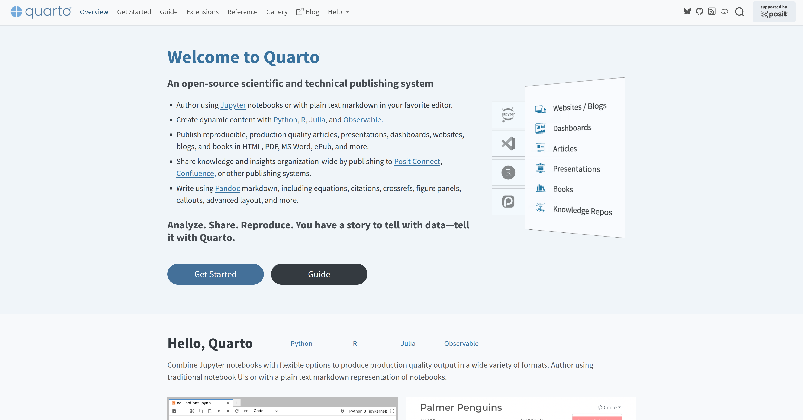](https://quarto.org/)

::: {.notes}

You can build websites to accompany your model. There's lots of ways to do this, but one I'm a big fan of is Quarto, which plays nicely with Python and R.

:::

<!----------------------------------------------------------------------------
------------------------------- Next slide -----------------------------------
----------------------------------------------------------------------------->

## Documentation: Website

[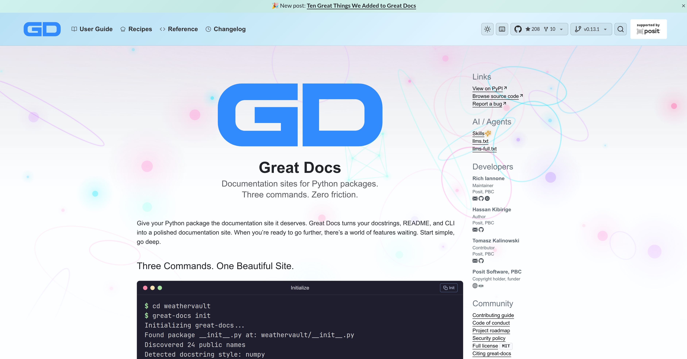](https://posit-dev.github.io/great-docs/)

::: {.notes}

A new package I've been playing with is Great-Docs, which builds on Quarto, and is good for Python packages, making set up of a documentation site very easy.

:::

<!----------------------------------------------------------------------------
------------------------------- Next slide -----------------------------------
----------------------------------------------------------------------------->

# Collaboration and sharing

::: {.notes}

Finally, collaboration and sharing.

:::

<!----------------------------------------------------------------------------
------------------------------- Next slide -----------------------------------
----------------------------------------------------------------------------->

## Code review

::: {.pale-gold}

Relevant guidelines:

* NHS Levels of RAP (🥉): Code has been peer reviewed.

:::

::: {.notes}

Code review is a baseline requirement in the NHS Levels of RAP.

:::

<!----------------------------------------------------------------------------
------------------------------- Next slide -----------------------------------
----------------------------------------------------------------------------->

## Code review

Check reproducibility and improve code quality.

::: {.fragment}

Recommend doing regularly during development - if possible!

:::

::: {.notes}

Code review can spot issues and improve code quality, and also involve ensuring work is reproducible by someone else.

---

We recommend doing it regularly during development, if possible.

:::

<!----------------------------------------------------------------------------
------------------------------- Next slide -----------------------------------
----------------------------------------------------------------------------->

## Code review

Review pull requests:

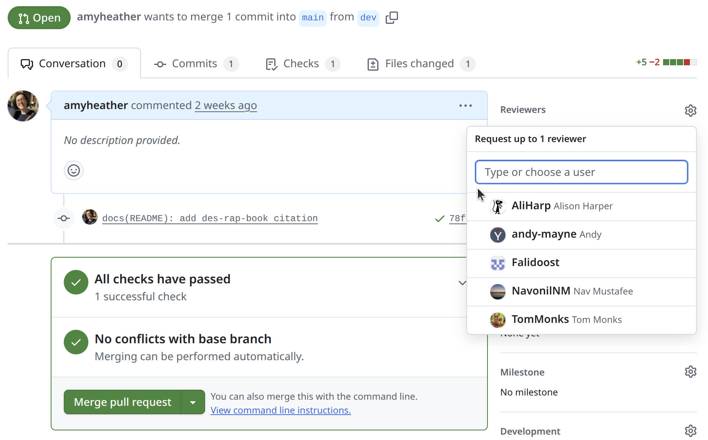

::: {.notes}

Pull requests are a great tool for review, which we explain in the book.

:::

<!----------------------------------------------------------------------------
------------------------------- Next slide -----------------------------------
----------------------------------------------------------------------------->

## Code review

Use GitHub issues.

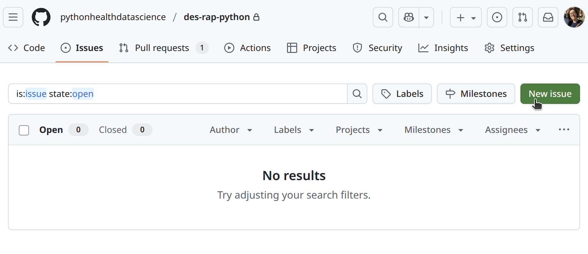

Cool things: (1) issue templates, (2) checklists, (3) sub-issues, (4) GitHub projects.

::: {.notes}

Also GitHub issues are great. With lots of nice features you can make use of like templates, checklists, sub-issues and GitHub projects.

:::

<!----------------------------------------------------------------------------
------------------------------- Next slide -----------------------------------
----------------------------------------------------------------------------->

## Code review

If you don't have anyone internal who can review your code, there are other options...

* Generative AI tools
* Online communities

::: {.notes}

Quite often, code review is easier said than done.

If you don't have anyone who can review code, their are online communities and initiatives.

The most accessible option that I use alot is generative AI tools. Obviously, being careful around not sharing sensitive information. But these can be great, just provide code, asking it to review, spot any issues, suggest improvements.

:::

<!----------------------------------------------------------------------------
------------------------------- Next slide -----------------------------------
----------------------------------------------------------------------------->

## Licensing

::: {.pale-gold}

Relevant guidelines:

* STARS Reproducibility Recommendations (⭐): Share code with an open licence.

:::

<!----------------------------------------------------------------------------
------------------------------- Next slide -----------------------------------
----------------------------------------------------------------------------->

## Licensing

A license is a text file that explains how other people are allowed to use your work.

Example - MIT license:

```{.txt}
MIT License

Copyright (c) [year] [fullname]

Permission is hereby granted, free of charge, to any person obtaining a copy
of this software and associated documentation files (the "Software"), to deal
in the Software without restriction, including without limitation the rights
to use, copy, modify, merge, publish, distribute, sublicense, and/or sell
copies of the Software, and to permit persons to whom the Software is
furnished to do so, subject to the following conditions:

The above copyright notice and this permission notice shall be included in all
copies or substantial portions of the Software.

THE SOFTWARE IS PROVIDED "AS IS", WITHOUT WARRANTY OF ANY KIND, EXPRESS OR
IMPLIED, INCLUDING BUT NOT LIMITED TO THE WARRANTIES OF MERCHANTABILITY,
FITNESS FOR A PARTICULAR PURPOSE AND NONINFRINGEMENT. IN NO EVENT SHALL THE
AUTHORS OR COPYRIGHT HOLDERS BE LIABLE FOR ANY CLAIM, DAMAGES OR OTHER
LIABILITY, WHETHER IN AN ACTION OF CONTRACT, TORT OR OTHERWISE, ARISING FROM,
OUT OF OR IN CONNECTION WITH THE SOFTWARE OR THE USE OR OTHER DEALINGS IN THE
SOFTWARE.
```

::: {.notes}

...

:::

<!----------------------------------------------------------------------------
------------------------------- Next slide -----------------------------------
----------------------------------------------------------------------------->

## Licensing

<br>

::: {style="text-align:center;"}

**No licence = no-one has permission to use your work**

:::

::: {.notes}

...

:::

<!----------------------------------------------------------------------------
------------------------------- Next slide -----------------------------------
----------------------------------------------------------------------------->

## Licensing

:::: {.columns}

::: {.column}

::: {style="font-size: 70%"}

For code:

<https://choosealicense.com/>

:::

[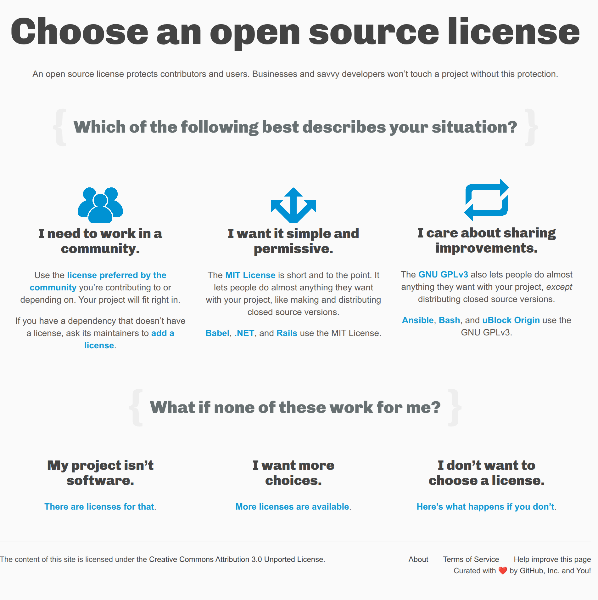](https://choosealicense.com/)

:::

::: {.column}

::: {style="font-size: 70%"}

For text:

<https://creativecommons.org/chooser/>

:::

[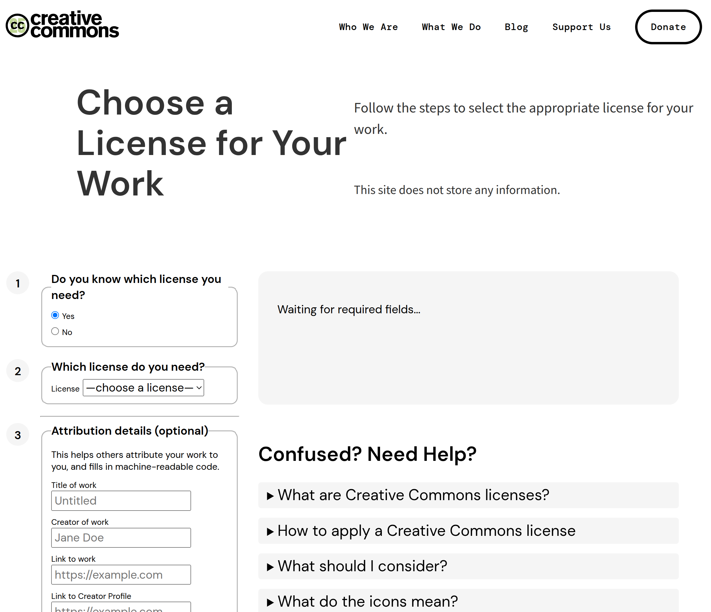](https://creativecommons.org/chooser/)
:::

::::

::: {.notes}

For help choosing an appropriate licence...

:::

<!----------------------------------------------------------------------------
------------------------------- Next slide -----------------------------------
----------------------------------------------------------------------------->

## Citation

::: {.incremental .show-first}

* Protect yourself and collaborators.
* Encourage others to cite you.
* Ensure accurate citation.
* Provide contact information.
* Recognise contributors.

:::

::: {.notes}

Provide citation information alongside your code is important.

Make sure you (and your collaborators) are recognised as the primary creators of the work.

---

When you make citation details easy to find and follow, others are more likely to cite your work. It makes it easier for them to do. Also, many people may not realise that non-traditional research outputs like software should be cited, so including explicit guidance helps educate and encourage users to give you credit.

---

Without citation instructions, others may only know your GitHub username. Therefore, it is important to provide all the correct details for a complete and accurate citation: full names, institution, ORCID iDs, software title, DOIs, etc.

---

Including your name and contact details in the citation information makes it easy for others to reach you. This can lead to new opportunities for collaboration, feedback, or questions about your work.

---

Explicitly list and acknowledge everyone who played a role in the project (including minor contributions). There are structured frameworks which can be used to specify roles, like the Contributor Role Taxonomy (CRediT) for research projects.

:::

<!----------------------------------------------------------------------------
------------------------------- Next slide -----------------------------------
----------------------------------------------------------------------------->

## Citation: `CITATION.cff`

<https://citation-file-format.github.io/cffinit/>

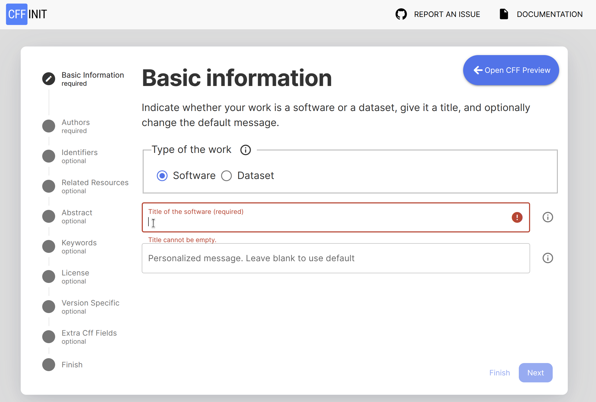

::: {.notes}

Many repositories use a `CITATION.cff` file to store structured citation metadata. You can make one easily using the cffinit tool.

:::

<!----------------------------------------------------------------------------
------------------------------- Next slide -----------------------------------
----------------------------------------------------------------------------->

## Citation: `CITATION.cff`

```{.txt}
# This CITATION.cff file was generated with cffinit.
# Visit https://bit.ly/cffinit to generate yours today!

cff-version: 1.2.0
title: "DES RAP Book: Reproducible Discrete-Event Simulation in Python and R"
message: >-
  If you use this software, please cite it using the
  metadata from this file.
type: software
authors:
  - given-names: Amy
    family-names: Heather
    email: a.heather2@exeter.ac.uk
    affiliation: University of Exeter Medical School
    orcid: 'https://orcid.org/0000-0002-6596-3479'
  - given-names: Tom
    family-names: Monks
    email: t.m.w.monks@exeter.ac.uk
    affiliation: University of Exeter Medical School
    orcid: http://orcid.org/0000-0003-2631-4481
  - given-names: Nav
    family-names: Mustafee
    email: n.mustafee@exeter.ac.uk
    affiliation: University of Exeter Business School
    orcid: https://orcid.org/0000-0002-2204-8924
  - given-names: Alison
    family-names: Harper
    email: a.l.harper@exeter.ac.uk
    affiliation: University of Exeter Business School
    orcid: https://orcid.org/0000-0001-5274-5037
  - given-names: Fatemeh
    family-names: Alidoost
    affiliation: University of Exeter Business School
    orcid: https://orcid.org/0009-0000-0252-560X
  - given-names: Rob
    family-names: Challen
    affiliation: School of Engineering, Mathematics and Technology, University of Bristol
    orcid: https://orcid.org/0000-0002-5504-7768
  - given-names: Tom
    family-names: Slater
    affiliation: Department of Mathematics and Statistics, University of Exeter
    orcid: https://orcid.org/0009-0007-0838-7499
repository-code: 'https://github.com/pythonhealthdatascience/des_rap_book'
abstract: >-
  Step-by-step guide for building Python and R simulation
  models as part of a reproducible analytical pipeline
  (RAP).
keywords:
  - reproducible
  - python
  - r
  - simpy
  - simmer
  - rap
license: MIT
version: '0.5.0'
date-released: '2026-02-20'
```

::: {.notes}

This is an example of one. It's just a plain text-file, that is human and machine readable, and supported by tools like GitHub, Zenodo and Zotero.

:::

<!----------------------------------------------------------------------------
------------------------------- Next slide -----------------------------------
----------------------------------------------------------------------------->

## Changelog

::: {.pale-gold}

Relevant guidelines:

* STARS Reproducibility Recommendations: Link publication to a specific version of the code.
* NHS Levels of RAP (🥇): Changes to the RAP are clearly signposted. E.g. a changelog in the package, releases etc.

:::

::: {.notes}

Versioning your code and mainintaing a changelog are also good practices to follow.

:::

<!----------------------------------------------------------------------------
------------------------------- Next slide -----------------------------------
----------------------------------------------------------------------------->

## Changelog

`CHANGELOG.md` (or `NEWS.md` for R packages) records changes to a project over time.

::: {.fragment}

Various conventions - e.g., [Keep a Changelog](https://keepachangelog.com/en/1.1.0/):

* `Added` for new features.
* `Changed` for changes in existing functionality.
* `Removed` for now removed features.
* `Fixed` for any bug fixes.
* `Deprecated` for soon-to-be-removed features.
* `Security` in case of vulnerabilities.

:::

::: {.notes}

...

:::

<!----------------------------------------------------------------------------
------------------------------- Next slide -----------------------------------
----------------------------------------------------------------------------->

## Changelog

```{.txt}
# Changelog

All notable changes to this project will be documented in this file.

The format is based on [Keep a Changelog](https://keepachangelog.com/en/1.1.0/),
and this project adheres to [Semantic Versioning](https://semver.org/spec/v2.0.0.html). Dates formatted as YYYY-MM-DD as per [ISO standard](https://www.iso.org/iso-8601-date-and-time-format.html).

## v0.2.0 - 2025-10-01

This release adds basic discrete event simulation capability, improves documentation, and corrects a key input parameter.

### Added

* Basic simulation that generates arrivals.

### Changed

* Improved the README for clarity and guidance.

### Fixed

* Fixed a bug where the default value for `service_rate` was incorrectly set to 0.5 instead of 1.0, which caused unrealistic queue times in the single-server example.

## v0.1.0 - 2025-09-23

First release of the repository, providing a minimal project structure with initial documentation.

### Added

* Initial repository structure: includes README, license, environment files.
* Project structured as a package.
* Basic simulation script with just parameter inputs.
```

::: {.notes}

You can see an example of a CHANGELOG here.

:::

<!----------------------------------------------------------------------------
------------------------------- Next slide -----------------------------------
----------------------------------------------------------------------------->

## Changelog: GitHub releases

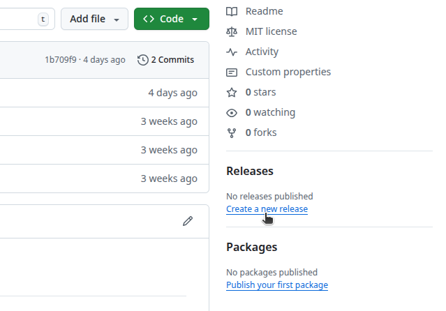

::: {.notes}

On GitHub, you can create releases for each version of your code.

:::

<!----------------------------------------------------------------------------
------------------------------- Next slide -----------------------------------
----------------------------------------------------------------------------->

## Changelog: GitHub releases

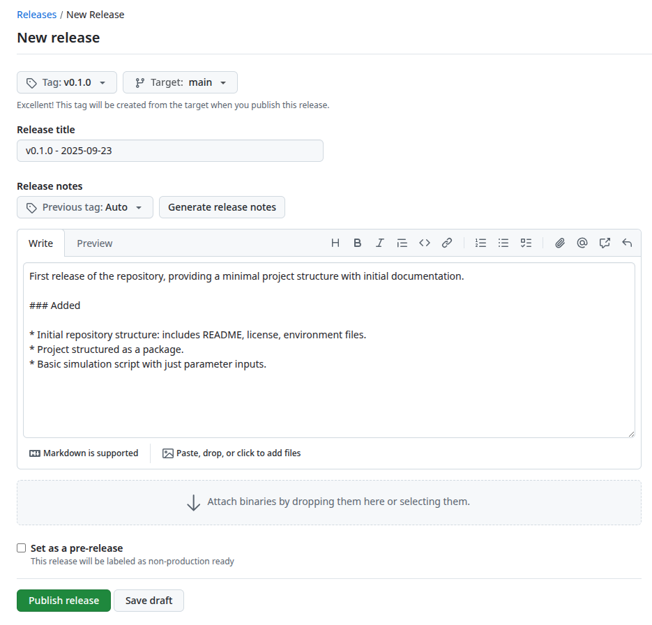

::: {.notes}

It contains the same information from your changelog.

:::

<!----------------------------------------------------------------------------
------------------------------- Next slide -----------------------------------
----------------------------------------------------------------------------->

## Changelog: GitHub releases

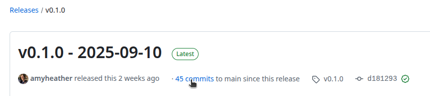

::: {.notes}

You can then look at changes in the files since the last release.

Keeping a changelog and making releases is good, as it means you have clear versions of your code over time. So it might be a version before feedback, then a version after you've made changes. Or your prototype, then the version presented in a meeting, then the version from the report, and so on.

When someone tries to reproduce your results, they can run the exact version of your code that you used, even if the project has moved on.

:::

<!----------------------------------------------------------------------------
------------------------------- Next slide -----------------------------------
----------------------------------------------------------------------------->

## Sharing and archiving

::: {.pale-gold}

Relevant guidelines:

* NHS Levels of RAP (🥉): Code is published in the open and linked to & from accompanying publication (if relevant).

:::

::: {.notes}

Finally, I want to mention sharing and archiving of code.

:::

<!----------------------------------------------------------------------------
------------------------------- Next slide -----------------------------------
----------------------------------------------------------------------------->

## Sharing and archiving

**Reporting guidelines:** for documenting model.

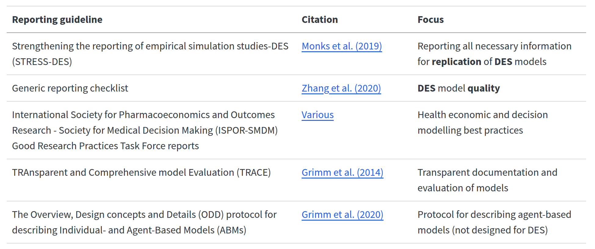

::: {.notes}

When sharing, there's lots of different reporting guidelines, providing guidance on how to document your DES model...

:::

<!----------------------------------------------------------------------------
------------------------------- Next slide -----------------------------------
----------------------------------------------------------------------------->

## Sharing and archiving

**Sharing guidelines:** for code, data and materials.

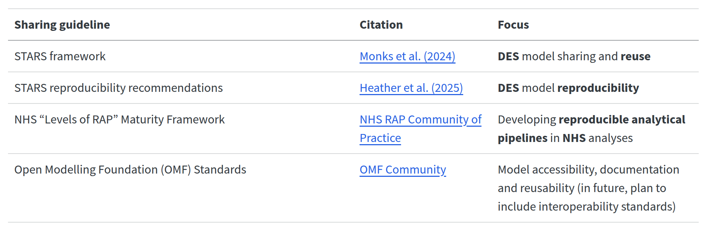

::: {.notes}

There are also guidelines around how to share code, data and other materials.

:::

<!----------------------------------------------------------------------------
------------------------------- Next slide -----------------------------------
----------------------------------------------------------------------------->

## Sharing and archiving

**Archives** provide long-term storage guarantees and create a DOI for your code.

Examples:

* [Zenodo](https://zenodo.org/)
* [Figshare](https://figshare.com/)
* [OSF](https://osf.io/)
* [CoMSES Net](https://www.comses.net/)

::: {.notes}

Whilst platforms like GitHub are great for sharing code, they provide no guarantees on how long the code will be stored. For this reason, we recommend also depositing your code in an open science archive.

...

:::

<!----------------------------------------------------------------------------
------------------------------- Next slide -----------------------------------
----------------------------------------------------------------------------->

## Sharing and archiving

**Archives** provide long-term storage guarantees and create a DOI for your code.

Examples:

* [Zenodo](https://zenodo.org/) - triggered by GitHub release:

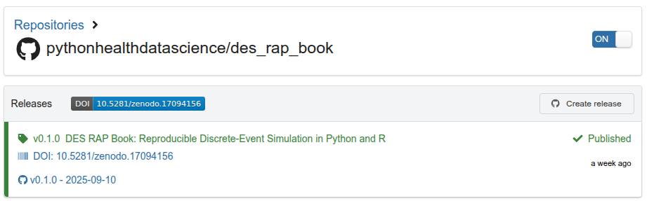

<!----------------------------------------------------------------------------
------------------------------- Next slide -----------------------------------
----------------------------------------------------------------------------->

# Conclusion

<!----------------------------------------------------------------------------
------------------------------- Next slide -----------------------------------
----------------------------------------------------------------------------->

## Acknowledgements

::: {style="font-size: 60%"}

The DES RAP Book was written by Amy Heather and reviewed by Nav Mustafee, Alison Harper, Tom Monks, Fatemeh Alidoost, Rob Challen and Tom Slater.

{fig-align="center"}

STARS is supported by the Medical Research Council [grant number MR/Z503915/1] from 1st May 2024 to 31st October 2026.

This work was also supported by the National Institute for Health and Care Research (NIHR) under the NIHR Applied Research Collaboration South West Peninsula (Grant Reference Number NIHR200167). The views expressed are those of the author(s) and not necessarily those of the NIHR or the Department of Health and Social Care.

:::

::: {style="text-align:center;"}

{width="18%"}
{width="18%"}
{width="25%"}

:::

<!----------------------------------------------------------------------------
------------------------------- Next slide -----------------------------------
----------------------------------------------------------------------------->

##

{fig-align="center"}

Check out:

<https://pythonhealthdatascience.github.io/des_rap_book/>

<https://doi.org/10.3310/nihropenres.14296.1>
